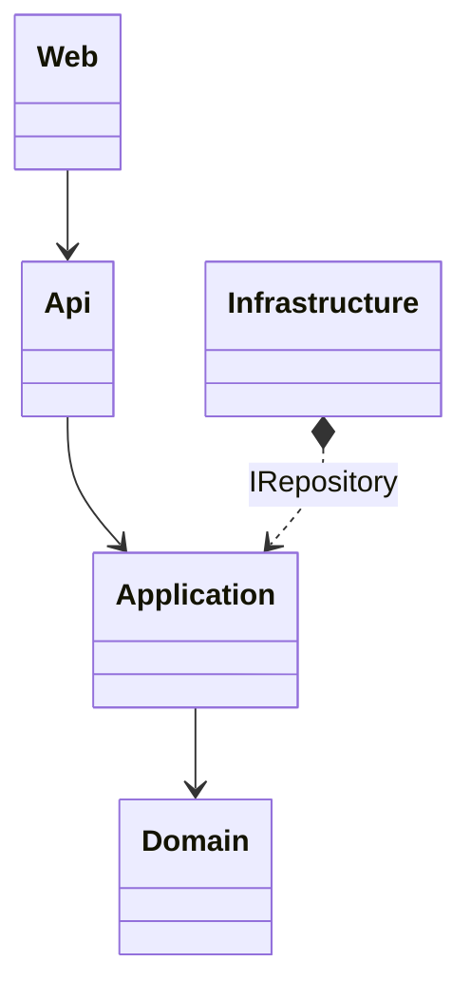

## Project structure
Domain-centric architecture: Clean Architecture

```
.
├── HICT.ICDETool.Application --> Application > Stuurt het domein aan
|   ├── Interfaces
|       ├── Repositiries > Interfaces voor persisitentie
|       ├── Services > Interfaces voor andere infrastructurele benodigdheden
├── HICT.ICDETool.SharedKernel --> Shared kernel > gebruikt in meerdere projecten, zoals value objects
├── HICT.ICDETool.Domain --> Domain logic > Domein werkt op zichzelf, en beheert eigen consistentie.
├── HICT.ICDETool.Infrastructure --> Implementatie van applicatie interfaces voor persistentie en services (onder andere EF CORE)
├── HICT.ICDETool.Api (entrypoint) --> Presentatie logica only, aanbieden van een rest api en deze aansturen middels swagger 
├── HICT.ICDETool.Tests (entrypoint voor tests)

|── HICT.ICDETool.Web --> (minste prio) Losse MVC app: het aanbieden van een javascript webapp die de swagger api consumeert.
```