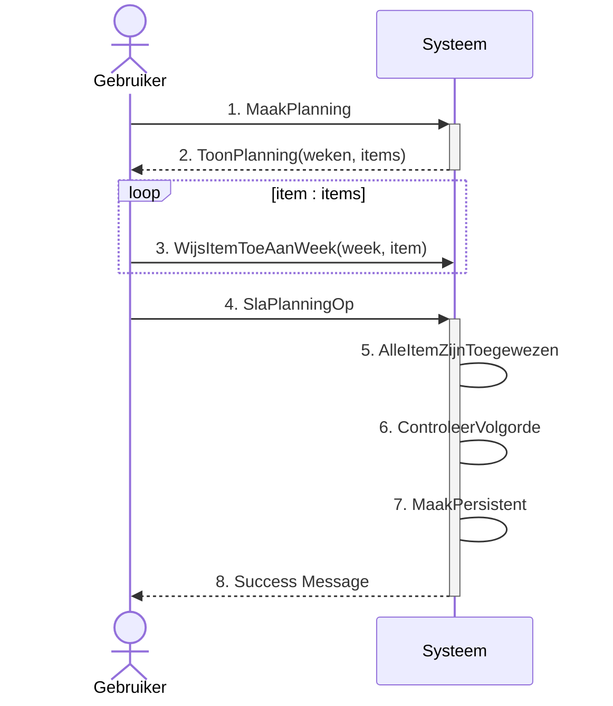
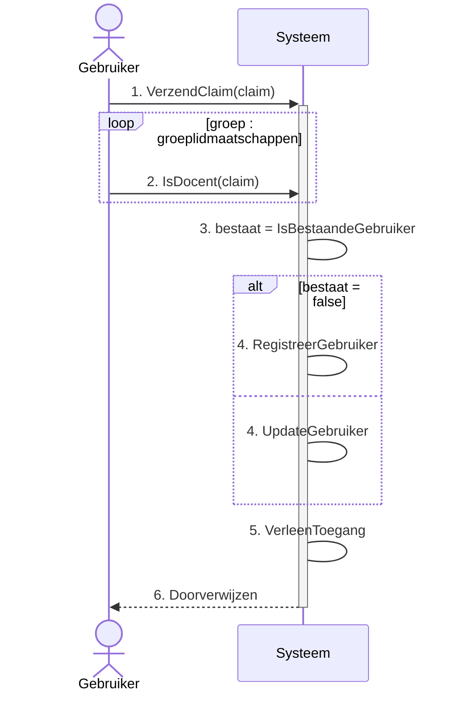

[Terug](./index.md)

# Use Case Overview

## CRUD Specificatie

- [UC-2 - Bekijken beoordelingen](#uc-2-bekijken-beoordelingen)
- [UC-3 - Beheer Gebruikers](#uc-3-beheer-gebruikers)
- [UC-4 - Beheer Klassen](#uc-4-beheer-klassen)
- [UC-7 - Beheer Opleidingen](#uc-7-beheer-opleidingen)
- [UC-9 - Beheer Opleidingsprofielen](#uc-9-beheer-opleidingsprofielen)
- [UC-12 - Ontwikkel Leerdoelen](#uc-12-ontwikkel-leerdoelen)

## Fully Dressed

- [UC-17 - Maak Weekplanning](#uc-17---maak-weekplanning)
- [UC-20 - Aanmelden](#uc-20-aanmelden)

# **UC-2 Bekijken beoordelingen**

| | |
|-|-|
| ID | UC-2 |
| Naam | Bekijken beoordelingen |
| Omschrijving | Deze use case is verantwoordelijk voor het inzichtelijk maken van beoordelingen voor studenten. |
| Scope | ICDE-Tool |
| Trigger | Gebruikers Interactie |
| Level | User-Goal |
| Primary Actor | Student |
| Belangen & belanghebbenden | - Student: Wil zijn/haar voorgang en behaalde resultaten kunnen bekijken. |
| Pre-Condities | - Authenticatie is afgehandeld; gebruiker is bevoegd om op het systeem in te loggen. |
| Succes definitie| - Er word een overzicht getoond van de course voortang in de vorm van een lijst van behaalde resultaten en het aantal behaalde studiepunten ten opzichte van het totaal haalbare aantal studiepunten.  |
| Requirement| FR-38 |
|  **Main Success Scenario** 
| **Actor** | **System** |
| 1. De student vraagt aan het systeem om een overzicht van alle beoordelingen. | |
| | 2. Het systeem haalt alle tentamineringen van de student op (ook die waarvoor nog geen beoordeling behaald is). |
| | 3. Het systeem categoriseert de beoordelingen per course uitvoering. |
| | 4. Het systeem berekent per course uitvoering het behaalde aantal studiepunten en de eindbeoordeling voor de course. (Een optelsom van de voorgeschreven studiepunten van de tentamineringen die onderdeel zijn van de desbetreffende course en voldoende afgerond zijn door de student) |
| | 5. Het systeem toont een overzicht van alle beoordelingen. |
|  **Alternative Flow A** 
| 2. *[De student heeft nog geen enkele course gevolgd]*   1. Het systeem toont dat er geen resultaten gevonden zijn.

[:point_up_2: [Overview](#use-case-overview)]

# **UC-3 Beheer Gebruikers**

| | |
|-|-|
| ID | UC-3 |
| Naam | Beheer Gebruikers  |
| Omschrijving | Deze use case is gebaseerd op het CRUD-template, binnen deze use case worden alleen uitzonderingen of specificiteit belicht. |
| Scope | ICDE-Tool |
| Trigger | Gebruikers Interactie |
| Level | User-Goal |
| Primary Actor | Docent |
| Belangen & belanghebbenden | - Docent: Wil een klas indeling kunnen bijhouden zodat studenten toegang krijgen tot het bijhorende course materiaal.   - Student: Wil onderdeel zijn van een klas zodat men toegang krijgt tot het bijhorende course materiaal. |
| Pre-Condities | - De docent is geauthentiseerd. (UC-20)  - De desbetreffende klas waarvan de student lid moet worden bestaat al. (UC-4) |
| Requirement| FR-4 |
|  **Afwijkende specificiteiten** 
| **Create/Update:** De benodigde data zijn een naam, email adres en in het geval van een student ook een klas, het systeem valideert of in deze databehoefte voorzien is.
| **Delete:** In het geval van een student verwijdert het systeem de student en alle persoons informatie zoals eventuele beoordelingen voor tentamens die hij/zij behaalt heeft. In het geval van een docent wordt er gekeken of de docent gerelateerd is aan een entiteit binnen het systeem, zoals een beoordeling, les of tentaminering, als dit een geval is kan de docent niet verwijderd worden.

[:point_up_2: [Overview](#use-case-overview)]

# **UC-4 Beheer Klassen**

| | |
|-|-|
| ID | UC-4 |
| Naam | Beheer Klassen  |
| Omschrijving | Deze use case is gebaseerd op het CRUD template, binnen deze use case worden alleen uitzonderingen of specificiteit belicht. |
| Scope | ICDE-Tool |
| Trigger | Gebruikers Interactie |
| Level | User-Goal |
| Primary Actor | Docent |
| Belangen & belanghebbenden | - Docent: Wil een klas registratie kunnen bijhouden zodat deze klas een course kan volgen.   - Student: Wil onderdeel kunnen zijn van een klas registratie zodat hij/zij de course informatie van de courses die de klas volgt kan inzien. |
| Pre-Condities | - De docent is geauthentiseerd. (UC-20)   - Het benodigde opleidingsprofiel is al aangemaakt. (UC-9) |
| Requirement| FR-29 |
|  **Afwijkende specificiteiten** 
| **Create/Update:** De benodigde data zijn een klas-id een naam voor de klas en een opleidingsprofiel dat de klas volgt, het systeem valideert of in deze databehoefte voorzien is.
| **Delete:** Het systeem controleer of er nog student onderdeel zijn van de klas en als deze gekoppeld is aan een course, een klas kan alleen verwijderd worden indien dit niet het geval is.

---
:warning: **_NOTE:_**
Een klas volgt een course maar technisch gezet wordt er tijdens het toevoegen van de klas aan de course iedere student individueel aan de course verbonden een student kan namelijk wisselen van klas en of blijven zitten. --> verwerken in UC-15 “Start Uitvoering”

---
[:point_up_2: [Overview](#use-case-overview)]

# **UC-7 Beheer Opleidingen**

| | |
|-|-|
| ID | UC-7 |
| Naam | Beheer Opleidingen  |
| Omschrijving | Deze use case is gebaseerd op het CRUD template, binnen deze use case worden alleen uitzonderingen of specificiteit belicht. |
| Scope | ICDE-Tool |
| Trigger | Gebruikers Interactie |
| Level | User-Goal |
| Primary Actor | Docent |
| Belangen & belanghebbenden | - Docent: Wil beschikbare opleidingen kunnen bijhouden zodat … |
| Pre-Condities | - De docent is geauthentiseerd. (UC-20) |
| Requirement| FR-29 |
|  **Afwijkende specificiteiten** 
| **Create/Update:** De benodigde data zijn een id en een naam, het systeem valideert of in deze databehoefte voorzien is.
| **Delete:** Het systeem controleert of er nog opleidingsprofielen gekoppeld zijn, een opleiding kan alleen verwijderd worden indien dit niet het geval is.

[:point_up_2: [Overview](#use-case-overview)]

# **UC-9 Beheer Opleidingsprofielen**

| | |
|-|-|
| ID | UC-9 |
| Naam | Beheer Opleidingsprofielen  |
| Omschrijving | Deze use case is gebaseerd of het CRUD-template, binnen deze use case worden alleen uitzonderingen of specificiteit belicht.|
| Scope | ICDE-Tool |
| Trigger | Gebruikers Interactie |
| Level | User-Goal |
| Primary Actor | Docent |
| Belangen & belanghebbenden | - Docent: Wil beschikbare opleidingsprofielen kunnen bijhouden zodat … |
| Pre-Condities | - De docent is geauthentiseerd. (UC-20)  - De desbetreffende opleiding waarvan onderdeel moet zijn bestaat al. (UC-7) |
| Requirement | FR-29 |
|  **Afwijkende specificiteiten** 
| **Create/Update:** De benodigde data zijn een id en een naam, het systeem valideert of in deze databehoefte voorzien is.
| **Delete:** Het systeem controleert of er nog klassen gekoppeld zijn aan het huidige profiel, een opleidingsprofiel kan alleen verwijderd worden indien dit niet het geval is.

[:point_up_2: [Overview](#use-case-overview)]

# **UC-10 Ontwikkel Leeruitkomst**

| | |
|-|-|
| ID | UC-10 |
| Naam | Ontwikkel Leeruitkomst  |
| Omschrijving | Deze use case is gebaseerd op het CRUD-template, binnen deze use case worden alleen uitzonderingen of specificiteit belicht. |
| Scope | ICDE-Tool |
| Trigger | Gebruikers Interactie |
| Level | User-Goal |
| Primary Actor | Docent |
| Belangen & belanghebbenden | - Docent: Wil vast kunnen leggen welke leeruitkomsten er binnen deze EVL behaald moeten worden zodat men hier passende leerdoelen aan kan verbinden.   - Student: Wil deze vastlegging kunnen inzien zodat men weet wat de beoogde leeruitkomsten zijn. |
| Pre-Condities | - De gebruiker is geauthentiseerd als docent. (UC-20)   - De EVL waaraan de leeruitkomst gekoppeld dient te worden bestaat al. |
| Requirement| FR-9 |
|  **Afwijkende specificiteiten** 
| **Create/Update:** De benodigde data zijn een titel, omschrijving & EVL waaronder de leeruitkomst zal vallen, het systeem valideert of in deze databehoefte voorzien is.
| **Delete:** Het systeem controleer of er nog leerdoelen verbonden zijn aan de leeruitkomst, een leeruitkomst kan alleen verwijderd worden indien dit niet het geval is.

[:point_up_2: [Overview](#use-case-overview)]

# **UC-12 Ontwikkel leerdoelen**

| | |
|-|-|
| ID | UC-12 |
| Naam | Ontwikkel Leerdoelen  |
| Omschrijving | Deze use case is gebaseerd op het CRUD-template, binnen deze use case worden alleen uitzonderingen of specificiteit belicht. |
| Scope | ICDE-Tool |
| Trigger | Gebruikers Interactie |
| Level | User-Goal |
| Primary Actor | Docent |
| Belangen & belanghebbenden | - Docent: Wil kunnen vastleggen welke leerdoelen er behaald moeten worden om tot een bepaalde leeruitkomst te kunnen komen.   - Student: Wil kunnen inzien wat de beoogde leerdoelen zijn. |
| Pre-Condities | - De docent is geauthentiseerd. (UC-20)   - De leeruitkomst waaraan het leerdoel verbonden zal worden bestaat al. |
| Requirement| FR-11 |
|  **Afwijkende specificiteiten** 
| **Create/Update:** De benodigde data zijn een titel, omschrijving & leeruitkomst waaraan het leerdoel gerelateerd is, het systeem valideert of in deze databehoefte voorzien is.
| **Delete:** Het systeem controleer of er nog lessen of tentamens verbonden zijn aan het leerdoel, een leerdoel kan alleen verwijderd worden indien dit niet het geval is.

[:point_up_2: [Overview](#use-case-overview)]

# **UC-17 - Maak Weekplanning**

| | |
|-|-|
| ID | UC-17 |
| Naam | Maak Weekplanning |
| Omschrijving | In een weekplanning worden lessen en tentamens verbonden aan een courseweek. |
| Scope | ICDE-Tool |
| Trigger | Gebruikers Interactie |
| Level | User-Goal |
| Primary Actor | Docent |
| Belangen & belanghebbenden | - Docent: wil een weekplanning maken van alle lessen, toetsen en tentamens in een course |
| Pre-Condities | - Course met alle bijbehorende onderdelen is aangemaakt |
| Requirement| FR-1, FR-18 |
|  **Main Success Scenario** 
| **Actor** | **System** |
| 1. De docent geeft aan een planning op te willen stellen. | |
| | 2. Het systeem toont een lijst van alle course weken en vraagt de gebruiker lessen en/of tentamens toe te wijzen aan deze weken. |
| 3. De docent wijst alle lessen en tentamens toe aan een lesweek. | |
| 4. De docent geeft aan de planning te willen opslaan. | |
| | 5. Het systeem controleert of elke les en alle tentamens toegewezen zijn aan een week. |
| | 6. Het systeem controleert of de tentamens voor een leerdoel ingepland zijn na alle lessen voor het gegeven gegeven lesdoel. |
| | 7. Het lesdoel wordt persistent opgeslagen. |
| | 8. Het systeem stelt de gebruiker op de hoogte van het feit dat de planning succesvol is opgeslagen. |
|  **Alternative Flow A** 
| 5a. *[Niet alle lessen of tentamens zijn toegewezen]*   1. Het systeem attendeert de gebruiker op het feit dat niet alle tentamens en of lessen toegewezen zijn.
| 6a. *[een of meerdere tentamens zijn ingepland voor dat alle bijhorende lessen zijn ingepland]*   1. Het systeem attendeert de gebruiker op het feit dat tentamens alleen ingepland kunnen worden nadat alle lessen voor de aan het tentamen verbonden leerdoelen gegeven zijn. 

## System Sequence Diagram (SSD)

[:point_up_2: [Overview](#use-case-overview)]

# **UC-20 Aanmelden**

| | |
|-|-|
| ID | UC-20 |
| Naam | Aanmelden |
| Omschrijving | Deze use case is verantwoordelijk voor het autoriseren en eventueel registreren van systeem gebruikers. Authenticatie valt buiten de scope van deze use case. |
| Scope | ICDE-Tool |
| Trigger | Authenticatie service |
| Level | User-Goal |
| Primary Actor | Student / Docent |
| Belangen & belanghebbenden | - Student / Docent: Wil kunnen inloggen en de acties waar tot zij bevoegd is kunnen uitvoeren.   - Docent: Wil studenten kunnen toevoegen aan een klas en docenten kunnen verbinden aan een les en of tentamen. |
| Pre-Condities | - Authenticatie is afgehandeld; gebruiker is bevoegd om op het systeem in te loggen. |
| Succes definitie| - Een representatie van de desbetreffende gebruiker is persistent opgeslagen.   - Er is een bevoegdheid toegekend aan de gebruiker voor de resterende duur van het bezoek. |
| Requirement| Van toepassing op vrijwel alle requirements |
|  **Main Success Scenario** 
| **Actor** | **System** |
| *[Bezoeker is doorverwezen door extern authenticatie systeem en heeft een claim verkregen]*   1. Verzend authenticatie claim naar systeem. | |
| | 2. Het systeem bekijkt op basis van de van het authenticatie systeem verkregen gegevens wat van type gebruiker het betreft; docent of student. |
| | 3. Het systeem bekijkt of de gebruiker al bestaat binnen het systeem op basis van het email adres.   *[De gebruiker bestaat nog niet]* |
| | 4. Het systeem registreert de gebruiker|
| | 5. Het systeem verleent de gebruiker toegang voor de duur van het bezoek. |
| | 6. De gebruiker wordt verwezen naar de plek die men initieel bezocht. |
|  **Alternative Flow A** 
| 3a. *[De gebruiker bestaat al]*   1. Het systeem controleert of het gebruikerstype gewijzigd is.   *[Het gebruiker type is gewijzigd]*   2. Het systeem overschrijft het huidige gebruikerstype met het nieuwe gebruikerstype.   *Ga verder bij stap 5.*
| 3b. *[De gebruiker bestaat al]*   1. Het systeem controleert of het gebruikerstype gewijzigd is.   *[Het gebruiker type is niet gewijzigd]*   *Ga verder bij stap 5*

[:point_up_2: [Overview](#use-case-overview)]

## System Sequence Diagram (SSD)

