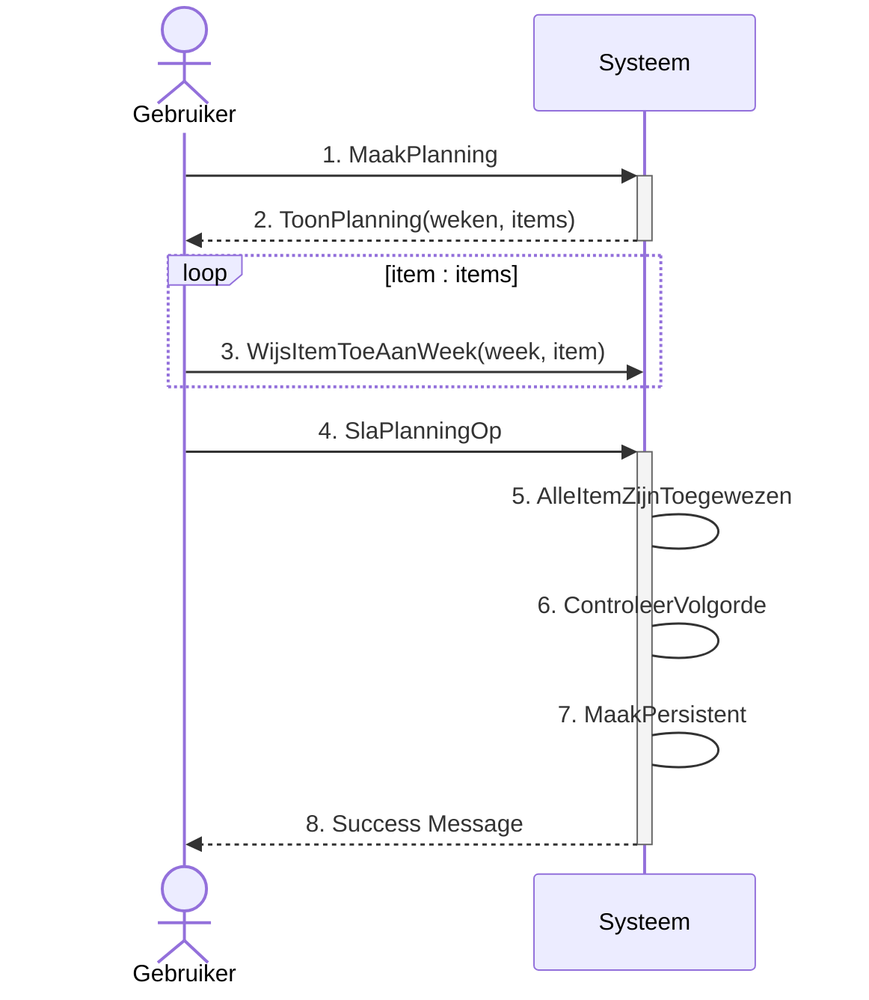
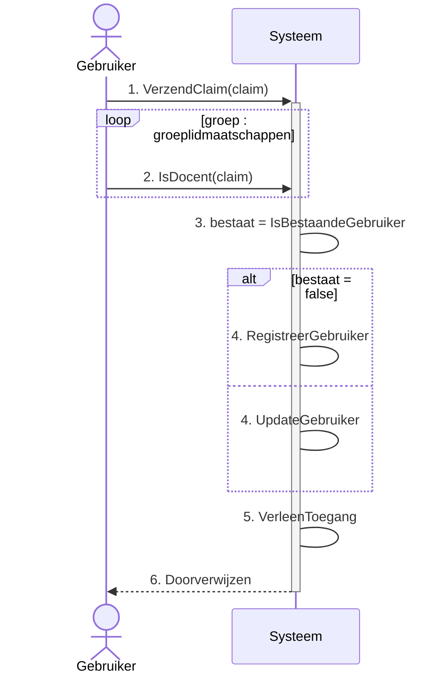

[Terug](./index.md)

# Use Case Overview

---
:warning: **_NOTITIE:_**
Niet alle use cases zijn uitgewerkt, de uitwerking van de niet uitgewerkte use cases waren toegewezen aan een collega student die het semester vroegtijdig heeft verlaten.

---

## CRUD Specificatie

- [x] [UC-1 - Ontwikkel Course](#uc-1-ontwikkel-course)
- [x] [UC-3 - Beheer Gebruikers](#uc-3-beheer-gebruikers)
- [x] [UC-4 - Beheer Klassen](#uc-4-beheer-klassen)
- [x] [UC-5 - Vraag course info op](#uc-5-vraag-course-info-op)
- [x] [UC-6 - Vraag course planning op](#uc-6-vraag-courseplanning-op)
- [x] [UC-7 - Beheer Opleidingen](#uc-7-beheer-opleidingen)
- [x] [UC-8 - Geef beoordeling](#uc-8-geef-beoordeling)
- [x] [UC-9 - Beheer Opleidingsprofielen](#uc-9-beheer-opleidingsprofielen)
- [x] [UC-10 - Ontwikkel Leeruitkomst](#uc-10-ontwikkel-leeruitkomst)
- [x] [UC-11 - Ontwikkel EVL](#uc-11-ontwikkel-evl)
- [x] [UC-12 - Ontwikkel Leerdoelen](#uc-12-ontwikkel-leerdoelen)
- [x] [UC-19 - Beheer Locaties](#uc-19-beheer-locaties)
- [x] [UC-22 - Ontwikkel Les](#uc-22-ontwikkel-les)

## Fully Dressed

- [x] [UC-2 - Bekijken beoordelingen](#uc-2-bekijken-beoordelingen)
- [x] [UC-13 - Ontwikkel toets](#uc-13-ontwikkel-toets)
- [x] [UC-14 - Maak rubriek](#uc-14-maak-rubriek)
- [x] [UC-15 - Start Uitvoering](#uc-15-start-uitvoering)
- [x] [UC-16 - Maak course planning definitief](#uc-16-maak-course-template-definitief)
- [x] [UC-17 - Maak Weekplanning](#uc-17---maak-weekplanning)
- [x] [UC-18 - Exporteer informatie](#uc-18-exporteer-informatie)
- [x] [UC-20 - Aanmelden](#uc-20-aanmelden)
- [x] [UC-21 - Ontwikkel beroepsproduct](#uc-21-ontwikkel-beroepsproduct)
- [x] [UC-23 - Nieuwe versie](#uc-23-nieuwe-versie)

# **UC-1 Ontwikkel Course**

<table>
  <tbody>
    <tr>
      <td><strong>ID</strong></td>
      <td>UC-1</td>
    </tr>
    <tr>
      <td><strong>Naam</strong></td>
      <td>Docent</td>
    </tr>
    <tr>
      <td><strong>Omschrijving</strong></td>
      <td>Deze use case is gebaseerd op het CRUD-template, binnen deze use case worden alleen uitzonderingen of
        specificiteit belicht.</td>
    </tr>
    <tr>
      <td><strong>Scope</strong></td>
      <td>ICDE-Tool</td>
    </tr>
    <tr>
      <td><strong>Trigger</strong></td>
      <td>Gebruikers Interactie</td>
    </tr>
    <tr>
      <td><strong>Level</strong></td>
      <td>User-Goal</td>
    </tr>
    <tr>
      <td><strong>Primary Actor</strong></td>
      <td>Docent</td>
    </tr>
    <tr>
      <td><strong>Belangen &amp; belanghebbenden</strong></td>
      <td>
        
- Docent: wil een course template maken en/of aanpassen.
        

        
- Student: 

      </td>
    </tr>
    <tr>
      <td><strong>Pre-Condities</strong></td>
      <td>- De docent is geauthentiseerd.
        

          
- De desbetreffende klas waarvan de student lid moet worden bestaat al. (UC-4)

        

      </td>
    </tr>
    <tr>
      <td><strong>Requirements</strong></td>
      <td>FR-1,28,3</td>
    </tr>
    <tr>
      <td><strong>Create/Update:</strong></td>
      <td>De benodigde data zijn een naam, email adres en in het geval van een student ook een klas, het systeem
        valideert of in deze databehoefte voorzien is.</td>
    </tr>
    <tr>
      <td><strong>Delete:</strong></td>
      <td>In het geval van een student verwijdert het systeem de student en alle persoons informatie zoals
        eventuele beoordelingen voor tentamens die hij/zij behaalt heeft. In het geval van een docent wordt er gekeken
        of de docent gerelateerd is aan een entiteit binnen het systeem, zoals een beoordeling, les of tentaminering,
        als dit een geval is kan de docent niet verwijderd worden.</td>
    </tr>
  </tbody>
</table>

[:point_up_2: [Overview](#use-case-overview)]

# **UC-2 Bekijken beoordelingen**

<table>
  <tbody>
    <tr>
      <td><strong>ID</strong></td>
      <td>UC-2</td>
    </tr>
    <tr>
      <td><strong>Naam</strong></td>
      <td>Bekijken beoordelingen</td>
    </tr>
    <tr>
      <td><strong>Omschrijving</strong></td>
      <td>Deze use case is verantwoordelijk voor het inzichtelijk maken van beoordelingen voor studenten.</td>
    </tr>
    <tr>
      <td><strong>Scope</strong></td>
      <td>ICDE-Tool</td>
    </tr>
    <tr>
      <td><strong>Trigger</strong></td>
      <td>Gebruikers Interactie</td>
    </tr>
    <tr>
      <td><strong>Level</strong></td>
      <td>User-Goal</td>
    </tr>
    <tr>
      <td><strong>Primary Actor</strong></td>
      <td>Student</td>
    </tr>
    <tr>
      <td><strong>Belangen &amp; belanghebbenden</strong></td>
      <td>- Student: Wil zijn/haar voorgang en behaalde resultaten kunnen bekijken.</td>
    </tr>
    <tr>
      <td><strong>Pre-Condities</strong></td>
      <td>- Authenticatie is afgehandeld; gebruiker is bevoegd om op het systeem in te loggen.</td>
    </tr>
    <tr>
      <td><strong>Succes definitie</strong></td>
      <td>- Er word een overzicht getoond van de course voortang in de vorm van een lijst van behaalde resultaten
        en het aantal behaalde studiepunten ten opzichte van het totaal haalbare aantal studiepunten.</td>
    </tr>
    <tr>
      <td><strong>Requirements</strong></td>
      <td>
        

          
FR-38

        

      </td>
    </tr>
    <tr>
      <td colspan="2"><strong>Main Success Scenario</strong></td>
    </tr>
    <tr>
      <td><strong>Actor</strong></td>
      <td><strong>System</strong></td>
    </tr>
    <tr>
      <td>
        

          
1. De student vraagt aan het systeem om een overzicht van alle beoordelingen.

        

      </td>
      <!-- 1.A  -->
      <td></td>
      <!-- 1.B  -->
    </tr>
    <tr>
      <td></td>
      <!-- 2.A  -->
      <td>
        

          
2. Het systeem haalt alle tentamineringen van de student op (ook die waarvoor nog geen beoordeling
            behaald is).

        

      </td>
      <!-- 2.B  -->
    </tr>
    <tr>
      <td></td>
      <!-- 3.A  -->
      <td>
        

          
3. Het systeem categoriseert de beoordelingen per course uitvoering.

        

      </td>
      <!-- 3.B  -->
    </tr>
    <tr>
      <td></td>
      <!-- 4.A  -->
      <td>
        

          
4. Het systeem berekent per course uitvoering het behaalde aantal studiepunten en de eindbeoordeling voor
            de course. (Een optelsom van de voorgeschreven studiepunten van de tentamineringen die onderdeel zijn van de
            desbetreffende course en voldoende afgerond zijn door de student)

        

      </td>
      <!-- 4.B  -->
    </tr>
    <tr>
      <td></td>
      <!-- 5.A  -->
      <td>
        

          
5. Het systeem toont een overzicht van alle beoordelingen.

        

      </td>
      <!-- 5.B  -->
    </tr>
  </tbody>
</table>

[:point_up_2: [Overview](#use-case-overview)]

# **UC-3 Beheer Gebruikers**

<table>
  <tbody>
    <tr>
      <td><strong>ID</strong></td>
      <td>UC-3</td>
    </tr>
    <tr>
      <td><strong>Naam</strong></td>
      <td>Beheer Gebruikers</td>
    </tr>
    <tr>
      <td><strong>Omschrijving</strong></td>
      <td>Deze use case is gebaseerd op het CRUD-template, binnen deze use case worden alleen uitzonderingen of
        specificiteit belicht.</td>
    </tr>
    <tr>
      <td><strong>Scope</strong></td>
      <td>ICDE-Tool</td>
    </tr>
    <tr>
      <td><strong>Trigger</strong></td>
      <td>Gebruikers Interactie</td>
    </tr>
    <tr>
      <td><strong>Level</strong></td>
      <td>User-Goal</td>
    </tr>
    <tr>
      <td><strong>Primary Actor</strong></td>
      <td>Docent</td>
    </tr>
    <tr>
      <td><strong>Belangen &amp; belanghebbenden</strong></td>
      <td>
        
- Docent: Wil een klas indeling kunnen bijhouden zodat studenten toegang krijgen tot het bijhorende course
          materiaal.

        
- Student: Wil onderdeel zijn van een klas zodat men toegang krijgt tot het bijhorende course materiaal.

      </td>
    </tr>
    <tr>
      <td><strong>Pre-Condities</strong></td>
      <td>- De docent is geauthentiseerd.
        

          
- De desbetreffende klas waarvan de student lid moet worden bestaat al. (UC-4)

        

      </td>
    </tr>
    <tr>
      <td><strong>Requirements</strong></td>
      <td>FR-4</td>
    </tr>
    <tr>
      <td><strong>Create/Update:</strong></td>
      <td>De benodigde data zijn een naam, email adres en in het geval van een student ook een klas, het systeem
        valideert of in deze databehoefte voorzien is.</td>
    </tr>
    <tr>
      <td><strong>Delete:</strong></td>
      <td>In het geval van een student verwijdert het systeem de student en alle persoons informatie zoals
        eventuele beoordelingen voor tentamens die hij/zij behaalt heeft. In het geval van een docent wordt er gekeken
        of de docent gerelateerd is aan een entiteit binnen het systeem, zoals een beoordeling, les of tentaminering,
        als dit een geval is kan de docent niet verwijderd worden.</td>
    </tr>
  </tbody>
</table>

[:point_up_2: [Overview](#use-case-overview)]

# **UC-4 Beheer Klassen**

<table>
  <tbody>
    <tr>
      <td><strong>ID</strong></td>
      <td>UC-4</td>
    </tr>
    <tr>
      <td><strong>Naam</strong></td>
      <td>Beheer Klassen</td>
    </tr>
    <tr>
      <td><strong>Omschrijving</strong></td>
      <td>Deze use case is gebaseerd op het CRUD template, binnen deze use case worden alleen uitzonderingen of
        specificiteit belicht.</td>
    </tr>
    <tr>
      <td><strong>Scope</strong></td>
      <td>ICDE-Tool</td>
    </tr>
    <tr>
      <td><strong>Trigger</strong></td>
      <td>Gebruikers Interactie</td>
    </tr>
    <tr>
      <td><strong>Level</strong></td>
      <td>User-Goal</td>
    </tr>
    <tr>
      <td><strong>Primary Actor</strong></td>
      <td>Docent</td>
    </tr>
    <tr>
      <td><strong>Belangen &amp; belanghebbenden</strong></td>
      <td>
        

          
- Docent: Wil een klas registratie kunnen bijhouden zodat deze klas een course kan volgen.

          
- Student: Wil onderdeel kunnen zijn van een klas registratie zodat hij/zij de course informatie van de
            courses die de klas volgt kan inzien.

        

      </td>
    </tr>
    <tr>
      <td><strong>Pre-Condities</strong></td>
      <td>
        

          
- De docent is geauthentiseerd. (UC-20)

          
- Het benodigde opleidingsprofiel is al aangemaakt. (UC-9)

        

      </td>
    </tr>
    <tr>
      <td><strong>Requirements</strong></td>
      <td>
        

          
FR-29

        

      </td>
    </tr>
    <tr>
      <td><strong>Create/Update:</strong></td>
      <td>
        

          
De benodigde data zijn een klas-id een naam voor de klas en een opleidingsprofiel dat de klas volgt, het
            systeem valideert of in deze databehoefte voorzien is.

        

      </td>
    </tr>
    <tr>
      <td><strong>Delete:</strong></td>
      <td>
        

          
Het systeem controleer of er nog student onderdeel zijn van de klas en als deze gekoppeld is aan een
            course, een klas kan alleen verwijderd worden indien dit niet het geval is.

        

      </td>
    </tr>
  </tbody>
</table>

[:point_up_2: [Overview](#use-case-overview)]
# **UC-5 Vraag course info op**

<table>
  <tbody>
    <tr>
      <td><strong>ID</strong></td>
      <td>UC-5</td>
    </tr>
    <tr>
      <td><strong>Naam</strong></td>
      <td>Vraag course informatie op </td>
    </tr>
    <tr>
      <td><strong>Omschrijving</strong></td>
      <td>Deze use case is gebaseerd op het CRUD template, binnen deze use case worden alleen uitzonderingen of
        specificiteit belicht.</td>
    </tr>
    <tr>
      <td><strong>Scope</strong></td>
      <td>ICDE-Tool</td>
    </tr>
    <tr>
      <td><strong>Trigger</strong></td>
      <td>Gebruikers Interactie</td>
    </tr>
    <tr>
      <td><strong>Level</strong></td>
      <td>User-Goal</td>
    </tr>
    <tr>
      <td><strong>Primary Actor</strong></td>
      <td>Docent / Student</td>
    </tr>
    <tr>
      <td><strong>Belangen &amp; belanghebbenden</strong></td>
      <td>
        
Student: wil de course informatie kunnen inzien zodat hij/zij weet wat de inhoud van de course is en wat er verwacht wordt.
        

        

        Docent: wil de course informatie kunnen inzien zodat hij/zij weet wanneer welke stof behandeld moet worden en wat de inhoud hiervan is.
 &hellip;

      </td>
    </tr>
    <tr>
      <td><strong>Pre-Condities</strong></td>
      <td>
        
- De docent/student is geauthentiseerd. (UC-20)

      </td>
    </tr>
    <tr>
      <td><strong>Requirements</strong></td>
      <td>
        

          
FR-5,3,8,27,38 

        

      </td>
    </tr>
    <tr>
      <td><strong>Read:</strong></td>
      <td>
        

          
De benodigde data is de course, het systeem toont de courseinformatie.
          

        

      </td>
    </tr>
  </tbody>
</table>

[:point_up_2: [Overview](#use-case-overview)]
# **UC-6 Vraag courseplanning op**

<table>
  <tbody>
    <tr>
      <td><strong>ID</strong></td>
      <td>UC-6</td>
    </tr>
    <tr>
      <td><strong>Naam</strong></td>
      <td>Vraag course planning op </td>
    </tr>
    <tr>
      <td><strong>Omschrijving</strong></td>
      <td>Deze use case is gebaseerd op het CRUD template, binnen deze use case worden alleen uitzonderingen of
        specificiteit belicht.</td>
    </tr>
    <tr>
      <td><strong>Scope</strong></td>
      <td>ICDE-Tool</td>
    </tr>
    <tr>
      <td><strong>Trigger</strong></td>
      <td>Gebruikers Interactie</td>
    </tr>
    <tr>
      <td><strong>Level</strong></td>
      <td>User-Goal</td>
    </tr>
    <tr>
      <td><strong>Primary Actor</strong></td>
      <td>Docent / Student</td>
    </tr>
    <tr>
      <td><strong>Belangen &amp; belanghebbenden</strong></td>
      <td>
        
Student: wil een course planning kunnen inzien zodat hij/zij weet wanneer welke activiteiten plaats vinden.
        

        

        Docent: wil een course planning kunnen inzien zodat hij/zij weet wanneer welke stof behandeld moet worden
 &hellip;

      </td>
    </tr>
    <tr>
      <td><strong>Pre-Condities</strong></td>
      <td>
        
- De docent/student is geauthentiseerd. (UC-20)

      </td>
    </tr>
    <tr>
      <td><strong>Requirements</strong></td>
      <td>
        

          
FR-3

        

      </td>
    </tr>
    <tr>
      <td><strong>Read:</strong></td>
      <td>
        

          
De benodigde data is de klas, het systeem toont de klas en de courseplanning.
          

        

      </td>
    </tr>
  </tbody>
</table>

[:point_up_2: [Overview](#use-case-overview)]

# **UC-7 Beheer Opleidingen**

<table>
  <tbody>
    <tr>
      <td><strong>ID</strong></td>
      <td>UC-7</td>
    </tr>
    <tr>
      <td><strong>Naam</strong></td>
      <td>Beheer Opleidingen</td>
    </tr>
    <tr>
      <td><strong>Omschrijving</strong></td>
      <td>Deze use case is gebaseerd op het CRUD template, binnen deze use case worden alleen uitzonderingen of
        specificiteit belicht.</td>
    </tr>
    <tr>
      <td><strong>Scope</strong></td>
      <td>ICDE-Tool</td>
    </tr>
    <tr>
      <td><strong>Trigger</strong></td>
      <td>Gebruikers Interactie</td>
    </tr>
    <tr>
      <td><strong>Level</strong></td>
      <td>User-Goal</td>
    </tr>
    <tr>
      <td><strong>Primary Actor</strong></td>
      <td>Docent</td>
    </tr>
    <tr>
      <td><strong>Belangen &amp; belanghebbenden</strong></td>
      <td>
        
- Docent: Wil beschikbare opleidingen kunnen bijhouden zodat &hellip;

      </td>
    </tr>
    <tr>
      <td><strong>Pre-Condities</strong></td>
      <td>
        
- De docent is geauthentiseerd. (UC-20)

      </td>
    </tr>
    <tr>
      <td><strong>Requirements</strong></td>
      <td>
        

          
FR-29

        

      </td>
    </tr>
    <tr>
      <td><strong>Create/Update:</strong></td>
      <td>
        

          
De benodigde data zijn een id en een naam, het systeem valideert of in deze databehoefte voorzien is.
          

        

      </td>
    </tr>
    <tr>
      <td><strong>Delete:</strong></td>
      <td>
        

          
Het systeem controleert of er nog opleidingsprofielen gekoppeld zijn, een opleiding kan alleen verwijderd
            worden indien dit niet het geval is.

        

      </td>
    </tr>
  </tbody>
</table>

[:point_up_2: [Overview](#use-case-overview)]
# **UC-8 Geef Beoordeling**

<table>
  <tbody>
    <tr>
      <td><strong>ID</strong></td>
      <td>UC-8</td>
    </tr>
    <tr>
      <td><strong>Naam</strong></td>
      <td>Geef beoordeling</td>
    </tr>
    <tr>
      <td><strong>Omschrijving</strong></td>
      <td>Deze usecase beschrijft het invoeren van beoordelingen bij gemaakte tentamen.</td>
    </tr>
    <tr>
      <td><strong>Scope</strong></td>
      <td>ICDE-Tool</td>
    </tr>
    <tr>
      <td><strong>Trigger</strong></td>
      <td>Gebruikers Interactie</td>
    </tr>
    <tr>
      <td><strong>Level</strong></td>
      <td>User-Goal</td>
    </tr>
    <tr>
      <td><strong>Primary Actor</strong></td>
      <td>Docent / Student</td>
    </tr>
    <tr>
      <td><strong>Belangen &amp; belanghebbenden</strong></td>
      <td>
        

        Docent: wil een tentamenbeoordeling vastleggen.
        

      </td>
    </tr>
    <tr>
      <td><strong>Pre-Condities</strong></td>
      <td>
        
- De docent/student is geauthentiseerd. (UC-20)

      </td>
    </tr>
    <tr>
      <td><strong>Succes definitie</strong></td>
      <td> Een tentamencijfer is vastgelegd bij de student die het tentamen heeft afgenomen. </td>
    </tr>
    <tr>
      <td><strong>Requirements</strong></td>
      <td>
        

          
FR-7

        

      </td>
    </tr>
    <tr>
      <td><strong>Update:</strong></td>
      <td>
        

          
De benodigde data is de klas, tentamen, student en het cijfer. het systeem  legt het cijfer vast.
          

        

      </td>
    </tr>
  </tbody>
</table>

[:point_up_2: [Overview](#use-case-overview)]

# **UC-9 Beheer Opleidingsprofielen**

<table>
  <tbody>
    <tr>
      <td><strong>ID</strong></td>
      <td>UC-9</td>
    </tr>
    <tr>
      <td><strong>Naam</strong></td>
      <td>Beheer Opleidingsprofielen</td>
    </tr>
    <tr>
      <td><strong>Omschrijving</strong></td>
      <td>
        

          
Deze use case is gebaseerd of het CRUD-template, binnen deze use case worden alleen uitzonderingen of
            specificiteit belicht.

        

      </td>
    </tr>
    <tr>
      <td><strong>Scope</strong></td>
      <td>ICDE-Tool</td>
    </tr>
    <tr>
      <td><strong>Trigger</strong></td>
      <td>Gebruikers Interactie</td>
    </tr>
    <tr>
      <td><strong>Level</strong></td>
      <td>User-Goal</td>
    </tr>
    <tr>
      <td><strong>Primary Actor</strong></td>
      <td>Docent</td>
    </tr>
    <tr>
      <td><strong>Belangen &amp; belanghebbenden</strong></td>
      <td>
        

          
- Docent: Wil beschikbare opleidingsprofielen kunnen bijhouden zodat &hellip;

        

      </td>
    </tr>
    <tr>
      <td><strong>Pre-Condities</strong></td>
      <td>
        
- De docent is geauthentiseerd. (UC-20)

        

          

            
- De desbetreffende opleiding waarvan onderdeel moet zijn bestaat al. (UC-7)

          

        

      </td>
    </tr>
    <tr>
      <td><strong>Requirements</strong></td>
      <td>
        

          
FR-29

        

      </td>
    </tr>
    <tr>
      <td><strong>Create/Update:</strong></td>
      <td>
        

          
De benodigde data zijn een id en een naam, het systeem valideert of in deze databehoefte voorzien is.
          

        

      </td>
    </tr>
    <tr>
      <td><strong>Delete:</strong></td>
      <td>
        

          
Het systeem controleert of er nog klassen gekoppeld zijn aan het huidige profiel, een opleidingsprofiel
            kan alleen verwijderd worden indien dit niet het geval is.

        

      </td>
    </tr>
  </tbody>
</table>

[:point_up_2: [Overview](#use-case-overview)]

# **UC-10 Ontwikkel Leeruitkomst**

<table>
  <tbody>
    <tr>
      <td><strong>ID</strong></td>
      <td>UC-10</td>
    </tr>
    <tr>
      <td><strong>Naam</strong></td>
      <td>
        

          
Ontwikkel Leeruitkomst

        

      </td>
    </tr>
    <tr>
      <td><strong>Omschrijving</strong></td>
      <td>
        

          
Deze use case is gebaseerd op het CRUD-template, binnen deze use case worden alleen uitzonderingen of
            specificiteit belicht.

        

      </td>
    </tr>
    <tr>
      <td><strong>Scope</strong></td>
      <td>ICDE-Tool</td>
    </tr>
    <tr>
      <td><strong>Trigger</strong></td>
      <td>Gebruikers Interactie</td>
    </tr>
    <tr>
      <td><strong>Level</strong></td>
      <td>User-Goal</td>
    </tr>
    <tr>
      <td><strong>Primary Actor</strong></td>
      <td>Docent</td>
    </tr>
    <tr>
      <td><strong>Belangen &amp; belanghebbenden</strong></td>
      <td>
        

          
- Docent: Wil vast kunnen leggen welke leeruitkomsten er binnen deze EVL behaald moeten worden zodat men
            hier passende leerdoelen aan kan verbinden.

          
- Student: Wil deze vastlegging kunnen inzien zodat men weet wat de beoogde leeruitkomsten zijn.

        

      </td>
    </tr>
    <tr>
      <td><strong>Pre-Condities</strong></td>
      <td>
        

          
- De gebruiker is geauthentiseerd als docent. (UC-20)

          
- De EVL waaraan de leeruitkomst gekoppeld dient te worden bestaat al.

        

      </td>
    </tr>
    <tr>
      <td><strong>Requirements</strong></td>
      <td>
        

          
FR-9

        

      </td>
    </tr>
    <tr>
      <td><strong>Create/Update:</strong></td>
      <td>
        

          
De benodigde data zijn een titel, omschrijving &amp; EVL waaronder de leeruitkomst zal vallen, het
            systeem valideert of in deze databehoefte voorzien is.

        

      </td>
    </tr>
    <tr>
      <td><strong>Delete:</strong></td>
      <td>
        

          
Het systeem controleer of er nog leerdoelen verbonden zijn aan de leeruitkomst, een leeruitkomst kan
            alleen verwijderd worden indien dit niet het geval is.

        

      </td>
    </tr>
  </tbody>
</table>

[:point_up_2: [Overview](#use-case-overview)]

# **uc-11-ontwikkel-evl**

<table>
  <tbody>
    <tr>
      <td><strong>ID</strong></td>
      <td>UC-11</td>
    </tr>
    <tr>
      <td><strong>Naam</strong></td>
      <td>Ontwikkel EVL </td>
    </tr>
    <tr>
      <td><strong>Omschrijving</strong></td>
      <td>Deze use case is gebaseerd op het CRUD template, binnen deze use case worden alleen uitzonderingen of
        specificiteit belicht.</td>
    </tr>
    <tr>
      <td><strong>Scope</strong></td>
      <td>ICDE-Tool</td>
    </tr>
    <tr>
      <td><strong>Trigger</strong></td>
      <td>Gebruikers Interactie</td>
    </tr>
    <tr>
      <td><strong>Level</strong></td>
      <td>User-Goal</td>
    </tr>
    <tr>
      <td><strong>Primary Actor</strong></td>
      <td>Docent</td>
    </tr>
    <tr>
      <td><strong>Belangen &amp; belanghebbenden</strong></td>
      <td>
        

        Docent: Als docent wil ik leeruitkomsten kunnen groeperen in een EVL zodat een course met vele leeruitkomsten overzichtelijk blijft. hiervoor wil de docent een EVL kunnen aanmaken.
 &hellip;

      </td>
    </tr>
    <tr>
      <td><strong>Pre-Condities</strong></td>
      <td>
        
- De docent is geauthentiseerd. (UC-20)

        
- Er bestaat een course 

      </td>
    </tr>
    <tr>
      <td><strong>Requirements</strong></td>
      <td>
        

          
FR-1,10

        

      </td>
    </tr>
    <tr>
      <td><strong>Create:</strong></td>
      <td>
        

          
 Een nieuw EVL wordt aangemaakt.
          

        

      </td>
    </tr>
  </tbody>
</table>

[:point_up_2: [Overview](#use-case-overview)]

# **UC-12 Ontwikkel leerdoelen**

<table>
  <tbody>
    <tr>
      <td><strong>ID</strong></td>
      <td>UC-12</td>
    </tr>
    <tr>
      <td><strong>Naam</strong></td>
      <td>
        

          
Ontwikkel Leerdoelen

        

      </td>
    </tr>
    <tr>
      <td><strong>Omschrijving</strong></td>
      <td>
        

          
Deze use case is gebaseerd op het CRUD-template, binnen deze use case worden alleen uitzonderingen of
            specificiteit belicht.

        

      </td>
    </tr>
    <tr>
      <td><strong>Scope</strong></td>
      <td>ICDE-Tool</td>
    </tr>
    <tr>
      <td><strong>Trigger</strong></td>
      <td>Gebruikers Interactie</td>
    </tr>
    <tr>
      <td><strong>Level</strong></td>
      <td>User-Goal</td>
    </tr>
    <tr>
      <td><strong>Primary Actor</strong></td>
      <td>Docent</td>
    </tr>
    <tr>
      <td><strong>Belangen &amp; belanghebbenden</strong></td>
      <td>
        

          
- Docent: Wil kunnen vastleggen welke leerdoelen er behaald moeten worden om tot een bepaalde
            leeruitkomst te kunnen komen.

          
- Student: Wil kunnen inzien wat de beoogde leerdoelen zijn.

        

      </td>
    </tr>
    <tr>
      <td><strong>Pre-Condities</strong></td>
      <td>
        

          
- De docent is geauthentiseerd. (UC-20)

          
- De leeruitkomst waaraan het leerdoel verbonden zal worden bestaat al.

        

      </td>
    </tr>
    <tr>
      <td><strong>Requirements</strong></td>
      <td>
        

          
FR-11

        

      </td>
    </tr>
    <tr>
      <td><strong>Create/Update:</strong></td>
      <td>
        

          
De benodigde data zijn een titel, omschrijving &amp; leeruitkomst waaraan het leerdoel gerelateerd is,
            het systeem valideert of in deze databehoefte voorzien is.

        

      </td>
    </tr>
    <tr>
      <td><strong>Delete:</strong></td>
      <td>
        

          
Het systeem controleer of er nog lessen of tentamens verbonden zijn aan het leerdoel, een leerdoel kan
            alleen verwijderd worden indien dit niet het geval is.

        

      </td>
    </tr>
  </tbody>
</table>

[:point_up_2: [Overview](#use-case-overview)]

# **UC-13 Ontwikkel toets**

<table>
  <tbody>
    <tr>
      <td><strong>ID</strong></td>
      <td>UC-13</td>
    </tr>
    <tr>
      <td><strong>Naam</strong></td>
      <td>Ontwikkel toetsing</td>
    </tr>
    <tr>
      <td><strong>Omschrijving</strong></td>
      <td>Het ontwikkelen van een toetsing bestaat uit het inladen (toevoegen) van een toets en een bijbehorend beoordelingsmodel deze toets krijgt een weging.</td>
    </tr>
    <tr>
      <td><strong>Scope</strong></td>
      <td>ICDE-Tool</td>
    </tr>
    <tr>
      <td><strong>Trigger</strong></td>
      <td>Gebruikers Interactie</td>
    </tr>
    <tr>
      <td><strong>Level</strong></td>
      <td>User-Goal</td>
    </tr>
    <tr>
      <td><strong>Primary Actor</strong></td>
      <td>Docent</td>
    </tr>
    <tr>
      <td><strong>Belangen &amp; belanghebbenden</strong></td>
      <td>Docent: wil op een consistente manier toetsing en nakijkmodellen beschikbaar voor een leerdoel.</td>
    </tr>
    <tr>
      <td><strong>Pre-Condities</strong></td>
      <td>Authenticatie is afgehandeld; gebruiker is bevoegd om op het systeem in te loggen.</td>
    </tr>
    <tr>
      <td><strong>Succes definitie</strong></td>
      <td>Er is een nieuwe schriftelijke toets met een nakijk model beschikbaar gemaakt binnen het systeem.</td>
    </tr>
    <tr>
      <td><strong>Requirements</strong></td>
      <td>
        

          
FR-7,6,37,12

        

      </td>
    </tr>
    <tr>
      <td colspan="2"><strong>Main Success Scenario</strong></td>
    </tr>
    <tr>
      <td><strong>Actor</strong></td>
      <td><strong>System</strong></td>
    </tr>
    <tr>
      <td>
        

          
1. Gebruiker start het toevoegen van nieuwe toetsing

        

      </td>
      <!-- 1.A  -->
      <td></td>
      <!-- 1.B  -->
    </tr>
    <tr>
      <td></td>
      <!-- 2.A  -->
      <td>
        

          
2. het systeem vraag wat voor typen toets het gaat

        

      </td>
      <!-- 2.B  -->
    </tr>
    <tr>
      <td>3. Gebruiker geeft een type.</td>
      <!-- 3.A  -->
      <td>
        

          
4. Het systeem vraagt om een toetsingsnaam.

        

      </td>
      <!-- 3.B  -->
    </tr>
    <tr>
      <td>5. Gebruiker geeft een naam.</td>
      <!-- 4.A  -->
      <td>
        

          
6. Het systeem controleert of er al een toets bestaat met deze naam.

          
7. Het systeem voegt een versienummer toe.

          
 8. Het systeem vraag gebruiker om het toets document.

        

      </td>
      <!-- 4.B  -->
    </tr>
    <tr>
      <td>9. Gebruiker geeft het toets document</td>
      <!-- 5.A  -->
      <td>
        

          
10. het systeem vraag gebruiker om het nakijkmodel

        

      </td>
      <!-- 5.B  -->
    </tr>
       <tr>
      <td>11. Gebruiker geeft het nakijkmodel</td>
      <!-- 6.A  -->
      <td>
        

          
12.Het systeem vraagt om de weging van de toets

        

      </td>
      <!-- 6.B  -->
    </tr>
       <tr>
      <td>13.Gebruiker geeft de weging</td>
      <!-- 7.A  -->
      <td>
        

         
14. Het systeem toont alle ingevoerde gegevens en vraag of deze correct zijn.

        

      </td>
      <!-- 7.B  -->
    </tr>
       <tr>
      <td>15.Gebruiker bevestigt</td>
      <!-- 8.A  -->
      <td>
        

          
16. Het systeem slaat de gegevens op en beëindigt het proces.

        

      </td>
      <!-- 8.B  -->
    </tr>
    <tr>
        <td colspan="2"><strong>Alternative flow 4</strong></td>
    </tr>
    <tr>
        <td colspan="2">4.a <em>[Toets bestaat al]</em>
             
            1.	Het systeem vraagt of bestaande toetsing wordt ge-update.
            2.	Gebruiker bevestigd. 
            3.	Het systeem maakt nieuwe toetsing met dezelfde naam maar met verhoogd versienummer.
             
            <em>Usecase gaat verder bij main succes scenario punt 8.</em>
        </td>
    </tr>
      <tr>
        <td colspan="2">4.b <em>[Toets bestaat al]</em>
             
           1.   Het systeem vraagt of bestaande toetsing wordt ge-update.
           2.   Gebruiker geeft aan dat dit niet het geval is.
              
            <em>Usecase gaat verder bij main succes scenario punt 4.</em>
        </td>
    </tr>
       <tr>
        <td colspan="2"><strong>Alternative flow 8+10</strong></td>
    </tr>
     <tr>
        <td colspan="2">8+10.a <em>[Systeem kan niet overweg met bestandstype]</em>
             
            1.	Het systeem geeft aan dat het bestandstype niet voldoet.
            2.	Het systeem vraag de gebruiker een bestand aan te leveren dat wel voldoet.
            3.	De gebruiker geeft een bestand van het juiste type. 
             
            <em>Het systeem gaat verder met het main succes scenario</em>
        </td>
    </tr>
      <tr>
        <td colspan="2">8+10.b <em>[Systeem kan niet overweg met bestandstype]</em>
             
            1.	Het systeem geeft aan dat het bestandstype niet voldoet.
            2.	Het systeem vraag de gebruiker een bestand aan te leveren dat wel voldoet.
            3.	De gebruiker geeft aan te willen stoppen met het proces
             
            <em>Het systeem stop het proces zonder invoer te verwerken</em>
        </td>
    </tr>
     <tr>
        <td colspan="2"><strong>Alternative flow 15</strong></td>
    </tr>
    <tr>
        <td colspan="2">15.a <em>[Gebruiker geeft aan dat invoer onjuist is]</em>
             
            1.	Hey systeem vraagt welke invoer onjuist is.
            2 .	Gebruiker geeft aan welke invoer onjuist is.
            3.	Het systeem maakt nieuwe toetsing met dezelfde naam maar met verhoogd versienummer.
             
            <em>Het systeem gaat naar de stap van het main succes scenario waarin de invoer opnieuw gedaan kan worden en vervolgt vanaf daar haar stappen.</em>
        </td>
    </tr>
  </tbody>
</table>

[:point_up_2: [Overview](#use-case-overview)]

# **UC-14 Maak rubriek**

<table>
  <tbody>
    <tr>
      <td><strong>ID</strong></td>
      <td>UC-14</td>
    </tr>
    <tr>
      <td><strong>Naam</strong></td>
      <td>Maak rubrieken</td>
    </tr>
    <tr>
      <td><strong>Omschrijving</strong></td>
      <td>Deze use case beschrijft hoe nieuwe rubrieken worden aangemaakt. De rubrieken horen bij een leerdoel. Elke rubriek krijgt een weging; de beoordeling van een rubriek kan 1 t/m 10 zijn maar kan hier ook van afwijken. Per beoordelingscriteria moet een beschrijving aanwezig zijn die het mogelijk maakt objectief te kunnen beoordelen. Binnen de rubrieken is het mogelijk om knock-outs te markeren en per rubriek moet er ruimte zijn voor commentaar.</td>
    </tr>
    <tr>
      <td><strong>Scope</strong></td>
      <td>ICDE-Tool</td>
    </tr>
    <tr>
      <td><strong>Trigger</strong></td>
      <td>Gebruikers Interactie</td>
    </tr>
    <tr>
      <td><strong>Level</strong></td>
      <td>User-Goal</td>
    </tr>
    <tr>
      <td><strong>Primary Actor</strong></td>
      <td>Docent</td>
    </tr>
    <tr>
      <td><strong>Belangen &amp; belanghebbenden</strong></td>
      <td>Docent: Wil een leerdoel voorzien van rubrieken zodat ze de beroepsproducten het leerdoel kunnen ondersteunen. 
      Student: Wil deze rubrieken kunnen inzien zodat hij/zij weet wat er verwacht wordt.
      </td>
    </tr>
    <tr>
      <td><strong>Pre-Condities</strong></td>
      <td>Authenticatie is afgehandeld; gebruiker is bevoegd om op het systeem in te loggen.</td>
    </tr>
    <tr>
      <td><strong>Succes definitie</strong></td>
      <td>-	Een is een rubriek aangemaakt voor het betreffende leerdoel.  
          -De rubrieken bevatten een altijd een weging en/of een knock-out criteria.
      </td>
    </tr>
    <tr>
      <td><strong>Requirements</strong></td>
      <td>
        

          
FR-13,21,22,23,39

        

      </td>
    </tr>
    <tr>
      <td colspan="2"><strong>Main Success Scenario</strong></td>
    </tr>
    <tr>
      <td><strong>Actor</strong></td>
      <td><strong>System</strong></td>
    </tr>
    <tr>
      <td>
        

          
1. Gebruiker start het aanmaken van een nieuwe rubriek

        

      </td>
      <!-- 1.A  -->
      <td></td>
      <!-- 1.B  -->
    </tr>
    <tr>
      <td></td>
      <!-- 2.A  -->
      <td>
        

          
2. Het systeem geeft de mogelijke leerdoelen.

        

      </td>
      <!-- 2.B  -->
    </tr>
    <tr>
      <td>3. Gebruiker kiest een leerdoel.</td>
      <!-- 3.A  -->
      <td>
        

          
4. het systeem vraag om een beoordelingsbeschrijving, een weging in %, een beoordelingstype, een knock-out criteria en een bijbehorend commentaar.

        

      </td>
      <!-- 3.B  -->
    </tr>
    <tr>
      <td>5. Gebruiker geeft de gevraagde informatie in</td>
      <!-- 4.A  -->
      <td>
        

          
6. Het systeem valideert invoer

          
7. Het systeem toont de nieuwe rubriek in 

          
 8. Het systeem vraagt of de gebruiker nog rubriek wil toevoegen.

        

      </td>
      <!-- 4.B  -->
    </tr>
    <tr>
      <td>9. Gebruiker geeft aan geen nieuwe rubriek toe te willen voegen.</td>
      <!-- 5.A  -->
      <td>
        

          
10.Het systeem beëindigt het proces.

        

      </td>
      <!-- 5.B  -->
    <tr>
        <td colspan="2"><strong>Alternative flow 2</strong></td>
    </tr>
    <tr>
        <td colspan="2">2.a <em>[Geen beroepsproduct aanwezig]</em>
             
           1.	Het systeem geeft aan dat er geen leerdoelen bestaan.
           2.	Het systeem vraagt of de gebruiker een leerdoel wil toevoegen. 
           3.	De gebruiker geeft aan een leerdoel toe te willen voegen
             
            <em>UC-12 wordt gestart.</em>
        </td>
    </tr>
      <tr>
        <td colspan="2">2.b <em>[Geen leerdoel aanwezig]</em>
             
        1.	Het systeem geeft aan dat er geen beroepsproducten bestaan.
        2.	Het systeem vraagt of de gebruiker een leerdoel wil toevoegen. 
        3.	De gebruiker geeft aan dit niet te willen
         
            <em>U4.	Het systeem beëindigt het proces.</em>
        </td>
    </tr>
       <tr>
        <td colspan="2"><strong>Alternative flow 6</strong></td>
    </tr>
     <tr>
        <td colspan="2">6.a <em>[Foutieve invoer]</em>
         
        1.	Het systeem toont de foutieve invoer.
        2.	Het systeem vraag de gebruiker de foutieve invoer te verbeteren.
        3.	De gebruiker herstelt de invoer. 
        4.	Het systeem valideert de invoer.
         
            <em>Het systeem gaat verder bij stap 7</em>
        </td>
    </tr>
      </tr>
       <tr>
        <td colspan="2"><strong>Alternative flow 8</strong></td>
    </tr>
      <tr>
        <td colspan="2">8.a <em>[Nieuwe invoer]</em>
             
            1.	De gebruiker geeft aan een nieuwe rubriek toe te willen voegen.
             
            <em>Het systeem gaat verder bij stap 4.</em>
        </td>
    </tr>
     
  </tbody>
</table>

[:point_up_2: [Overview](#use-case-overview)]

# **UC-15 Start uitvoering**

<table>
    <tbody>
        <tr>
            <td><strong>ID</strong></td>
            <td>UC-15</td>
        </tr>
        <tr>
            <td><strong>Naam</strong></td>
            <td>Start uitvoering</td>
        </tr>
        <tr>
            <td><strong>Omschrijving</strong></td>
            <td>Een uitvoering maakt gebruik van een template. Hierbij worden de course weken ingepland in
                lesweken. Hierbij wordt elke les en toetsing voorzien van docent en locatie. Een klas wordt toegewezen
                aan de course waardoor de studenten inzage hebben in de course.</td>
        </tr>
        <tr>
            <td><strong>Scope</strong></td>
            <td>ICDE-Tool</td>
        </tr>
        <tr>
            <td><strong>Trigger</strong></td>
            <td>Gebruikers Interactie</td>
        </tr>
        <tr>
            <td><strong>Level</strong></td>
            <td>User-Goal</td>
        </tr>
        <tr>
            <td><strong>Primary Actor</strong></td>
            <td>Docent</td>
        </tr>
        <tr>
            <td><strong>Belangen &amp; belanghebbenden</strong></td>
            <td>- Docent wil op basis van een template een course uitvoering starten. - Student wil een course
                kunnen volgen</td>
        </tr>
        <tr>
            <td><strong>Pre-Condities</strong></td>
            <td>- Template is definitief  - Docenten zijn beschikbaar  - Klassen zijn beschikbaar  -
                Locaties zijn beschikbaar</td>
        </tr>
        <tr>
            <td><strong>Succes definitie</strong></td>
            <td>Er is een nieuwe course uitvoering waaraan een klas met studenten zit gekoppeld</td>
        </tr>
        <tr>
            <td><strong>Requirements</strong></td>
            <td>FR-30, 32, 33</td>
        </tr>
        <tr>
            <td colspan="2"><strong>Main Success Scenario</strong></td>
        </tr>
        <tr>
            <td><strong>Actor</strong></td>
            <td><strong>System</strong></td>
        </tr>
        <tr>
            <td>
                
1. Gebruiker geeft aan dat er een nieuwe course uitvoering aangemaakt kan worden

            </td>
            <!-- 1.A  -->
            <td></td>
            <!-- 1.B  -->
        </tr>
        <tr>
            <td></td>
            <!-- 2.A  -->
            <td>2.Systeem vraagt om template en klas</td>
            <!-- 2.B  -->
        </tr>
        <tr>
            <td>3.Gebruiker kiest een template en klas</td>
            <!-- 3.A  -->
            <td></td>
            <!-- 3.B  -->
        </tr>
        <tr>
            <td></td>
            <!-- 4.A  -->
            <td>4.Systeem vraagt om de lessen te voorzien van docent</td>
            <!-- 4.B  -->
        </tr>
        <tr>
            <td></td>
            <!-- 5.A  -->
            <td></td>
            <!-- 5.B  -->
        </tr>
        <tr>
            <td></td>
            <!-- 6.A  -->
            <td>6. Systeem vraagt om de lessen te voorzien van locatie</td>
            <!-- 6.B  -->
        </tr>
        <tr>
        <tr>
            <td></td>
            <!-- 7.A  -->
            <td></td>
            <!-- 7.B  -->
        </tr>
        <tr>
        <tr>
            <td></td>
            <!-- 8.A  -->
            <td>8. Systeem mapped de course weken aan lesweken </td>
            <!-- 8.B  -->
        </tr>
        <tr>
            <td colspan="2"><strong>Alternative flow A</strong></td>
        </tr>
        <tr>
            <td colspan="2">6.a <em>[Les is online]</em> 
                1. De les hoeft geen locatie te hebben  
                <em>Ga verder bij Stap 8</em>
            </td>
        </tr>
    </tbody>
</table>

[:point_up_2: [Overview](#use-case-overview)]

# **UC-16 Maak course template definitief**

<table>
    <tbody>
        <tr style="height: 23px;">
            <td style="height: 23px;"><strong>ID</strong></td>
            <td style="height: 23px;">UC-16</td>
        </tr>
        <tr style="height: 23px;">
            <td style="height: 23px;"><strong>Naam</strong></td>
            <td style="height: 23px;">Maak course template definitief</td>
        </tr>
        <tr style="height: 133px;">
            <td style="height: 133px;"><strong>Omschrijving</strong></td>
            <td style="height: 133px;">
                
Wanneer een course volledig ingericht is kan een docent deze definitief maken. Hierbij wordt de
                    inhoud van een course gevalideerd aan een aantal regels:  - Elk leeruitkomst bevat een of
                    meerdere leerdoelen  - Elk leerdoel is opgenomen in minimaal 1 les  - Elk leerdoel wordt
                    getoetst door middel van een schriftelijke toets of een beroepsproduct  - Een course bevat de
                    juiste hoeveelheid EC

            </td>
        </tr>
        <tr style="height: 23px;">
            <td style="height: 23px;"><strong>Scope</strong></td>
            <td style="height: 23px;">ICDE-Tool</td>
        </tr>
        <tr style="height: 23px;">
            <td style="height: 23px;"><strong>Trigger</strong></td>
            <td style="height: 23px;">Gebruikers Interactie</td>
        </tr>
        <tr style="height: 23px;">
            <td style="height: 23px;"><strong>Level</strong></td>
            <td style="height: 23px;">User-Goal</td>
        </tr>
        <tr style="height: 23px;">
            <td style="height: 23px;"><strong>Primary Actor</strong></td>
            <td style="height: 23px;">Docent</td>
        </tr>
        <tr style="height: 43px;">
            <td style="height: 43px;"><strong>Belangen &amp; belanghebbenden</strong></td>
            <td style="height: 43px;">- Docent: wil een course template registreren als compleet. Hierdoor kan deze
                gebruikt worden als template voor een uitvoering</td>
        </tr>
        <tr style="height: 56px;">
            <td style="height: 56px;"><strong>Pre-Condities</strong></td>
            <td style="height: 56px;">- De template is voorzien van alle informatie  - De gebruiker is ingelogd als
                docent</td>
        </tr>
        <tr style="height: 23px;">
            <td style="height: 23px;"><strong>Succes definitie</strong></td>
            <td style="height: 23px;">De template is klaar om gebruikt te worden waardoor een nieuwe course uitvoering
                gestart kan worden.</td>
        </tr>
        <tr style="height: 23px;">
            <td style="height: 23px;"><strong>Requirements</strong></td>
            <td style="height: 23px;">FR-1, 30, 34, 36</td>
        </tr>
        <tr style="height: 23px;">
            <td style="height: 23px;" colspan="2"><strong>Main Success Scenario</strong></td>
        </tr>
        <tr style="height: 23px;">
            <td style="height: 23px;"><strong>Actor</strong></td>
            <td style="height: 23px;"><strong>System</strong></td>
        </tr>
        <tr style="height: 53px;">
            <td style="height: 53px;">
                
1. Gebruiker navigeert naar een course template

            </td>
            <!-- 1.A  -->
            <td style="height: 53px;"></td>
            <!-- 1.B  -->
        </tr>
        <tr style="height: 23px;">
            <td style="height: 23px;"></td>
            <!-- 2.A  -->
            <td style="height: 23px;">2. Overzicht van de course wordt weergegeven</td>
            <!-- 2.B  -->
        </tr>
        <tr style="height: 23px;">
            <td style="height: 23px;">3. Gebruiker geeft aan dat de course template definitief gemaakt kan worden.
            </td>
            <!-- 3.A  -->
            <td style="height: 23px;"></td>
            <!-- 3.B  -->
        </tr>
        <tr style="height: 23px;">
            <td style="height: 23px;"></td>
            <!-- 4.A  -->
            <td style="height: 23px;">4. Systeem bepaald of de course EVL&rsquo;s bevat</td>
            <!-- 4.B  -->
        </tr>
        <tr style="height: 23px;">
            <td style="height: 23px;"></td>
            <!-- 5.A  -->
            <td style="height: 23px;">5. Systeem bepaald of de som van EC&rsquo;s overeenkomt met minimaal 30
                EC&rsquo;s per semester (20 weken)</td>
            <!-- 5.B  -->
        </tr>
        <tr style="height: 23px;">
            <td style="height: 23px;"></td>
            <!-- 6.A  -->
            <td style="height: 23px;">6. Systeem bepaald voor elk leeruitkomst of deze minimaal 1 leerdoel bevat
            </td>
            <!-- 6.B  -->
        </tr>
        <tr style="height: 23px;">
            <td style="height: 23px;"></td>
            <!-- 7.A  -->
            <td style="height: 23px;">7.Systeem bepaald voor elk leerdoel in de leeruitkomst of deze
                verbonden is aan een les en toetsing</td>
            <!-- 7.B  -->
        </tr>
        <tr style="height: 23px;">
            <td style="height: 23px;"></td>
            <!-- 8.A  -->
            <td style="height: 23px;">8. System persisteert de gegevens.</td>
            <!-- 8.B  -->
        </tr>
        <tr style="height: 23px;">
            <td style="height: 23px;" colspan="2"><strong>Alternative flow A</strong></td>
        </tr>
        <tr style="height: 63px;">
            <td style="height: 63px;" colspan="2">4.a/5.a/6.a/7.a<em>[Validatie mislukt]</em>  1. Het systeem
                geeft voor elke mislukte validatie de onderdelen weer die niet voldoen.</td>
        </tr>
    </tbody>
</table>

[:point_up_2: [Overview](#use-case-overview)]

# **UC-17 - Maak Weekplanning**

<table>
  <tbody>
    <tr>
      <td><strong>ID</strong></td>
      <td>UC-17</td>
    </tr>
    <tr>
      <td><strong>Naam</strong></td>
      <td>
        

          
Maak Weekplanning

        

      </td>
    </tr>
    <tr>
      <td><strong>Omschrijving</strong></td>
      <td>
        

          
In een weekplanning worden lessen en tentamens verbonden aan een courseweek.

        

      </td>
    </tr>
    <tr>
      <td><strong>Scope</strong></td>
      <td>ICDE-Tool</td>
    </tr>
    <tr>
      <td><strong>Trigger</strong></td>
      <td>Gebruikers Interactie</td>
    </tr>
    <tr>
      <td><strong>Level</strong></td>
      <td>User-Goal</td>
    </tr>
    <tr>
      <td><strong>Primary Actor</strong></td>
      <td>
        

          
Docent

        

      </td>
    </tr>
    <tr>
      <td><strong>Belangen &amp; belanghebbenden</strong></td>
      <td>
        

          
- Docent: wil een weekplanning maken van alle lessen, toetsen en tentamens in een course

        

      </td>
    </tr>
    <tr>
      <td><strong>Pre-Condities</strong></td>
      <td>
        

          
- Course met alle bijbehorende onderdelen is aangemaakt.

        

      </td>
    </tr>
    <tr>
      <td><strong>Succes definitie</strong></td>
      <td></td>
    </tr>
    <tr>
      <td><strong>Requirements</strong></td>
      <td>FR-1, FR-18</td>
    </tr>
    <tr>
      <td colspan="2"><strong>Main Success Scenario</strong></td>
    </tr>
    <tr>
      <td><strong>Actor</strong></td>
      <td><strong>System</strong></td>
    </tr>
    <tr>
      <td>1. De docent geeft aan een planning op te willen stellen.
        

      </td>
      <!-- 1.A  -->
      <td></td>
      <!-- 1.B  -->
    </tr>
    <tr>
      <td></td>
      <!-- 2.A  -->
      <td>2. Het systeem toont een lijst van alle course weken en vraagt de gebruiker lessen en/of tentamens toe
        te wijzen aan deze weken.</td>
      <!-- 2.B  -->
    </tr>
    <tr>
      <td>3. De docent wijst alle lessen en tentamens toe aan een lesweek.</td>
      <!-- 3.A  -->
      <td></td>
      <!-- 3.B  -->
    </tr>
    <tr>
      <td>
        

          
4. De docent geeft aan de planning te willen opslaan.

        

      </td>
      <!-- 4.A  -->
      <td></td>
      <!-- 4.B  -->
    </tr>
    <tr>
      <td></td>
      <!-- 5.A  -->
      <td>
        

          

            
5. Het systeem controleert of elke les en alle tentamens toegewezen zijn aan een week.

          

        

      </td>
      <!-- 5.B  -->
    </tr>
    <tr>
      <td></td>
      <!-- 6.A  -->
      <td>6. Het systeem controleert of de tentamens voor een leerdoel ingepland zijn na alle lessen voor het gegeven
        gegeven lesdoel.</td>
      <!-- 6.B  -->
    </tr>
    <tr>
      <td></td>
      <!-- 7.A  -->
      <td>7. Het lesdoel wordt persistent opgeslagen.</td>
      <!-- 7.B  -->
    </tr>
    <tr>
      <td></td>
      <!-- 8.A  -->
      <td>8. Het systeem stelt de gebruiker op de hoogte van het feit dat de planning succesvol is opgeslagen.</td>
      <!-- 8.B  -->
    </tr>
    <tr>
      <td colspan="2"><strong>Alternative flow A</strong></td>
    </tr>
    <tr>
      <td colspan="2">5a. <em>[Niet alle lessen of tentamens zijn toegewezen]</em> 
        1. Het systeem attendeert de gebruiker op het feit dat niet alle tentamens en of lessen toegewezen zijn.</td>
    </tr>
    <tr>
      <td colspan="2">6a. <em>[een of meerdere tentamens zijn ingepland voor dat alle bijhorende lessen zijn
          ingepland]</em> 
        1. Het systeem attendeert de gebruiker op het feit dat tentamens alleen ingepland kunnen worden nadat alle
        lessen voor de aan het tentamen verbonden leerdoelen gegeven zijn. </td>
    </tr>
  </tbody>
</table>

## System Sequence Diagram (SSD)

[:point_up_2: [Overview](#use-case-overview)]
# **UC-18 Exporteer informatie**

<table>
  <tbody>
    <tr>
      <td><strong>ID</strong></td>
      <td>UC-18</td>
    </tr>
    <tr>
      <td><strong>Naam</strong></td>
      <td>Exporteer informatie</td>
    </tr>
    <tr>
      <td><strong>Omschrijving</strong></td>
      <td>De usecase beschrijft het exporteren van lesmateriaal</td>
    </tr>
    <tr>
      <td><strong>Scope</strong></td>
      <td>ICDE-Tool</td>
    </tr>
    <tr>
      <td><strong>Trigger</strong></td>
      <td>Gebruikers Interactie</td>
    </tr>
    <tr>
      <td><strong>Level</strong></td>
      <td>User-Goal</td>
    </tr>
    <tr>
      <td><strong>Primary Actor</strong></td>
      <td>Student</td>
    </tr>
    <tr>
      <td><strong>Belangen &amp; belanghebbenden</strong></td>
      <td>- Student: Wil het lesmateriaal bijhorend bij een les kunnen exporteren zodat deze data i offline beschikbaar is in het gewenste format. 
    </tr>
    <tr>
      <td><strong>Pre-Condities</strong></td>
      <td>Authenticatie is afgehandeld; gebruiker is bevoegd om op het systeem in te loggen en volgt een course.</td>
    </tr>
    <tr>
      <td><strong>Succes definitie</strong></td>
      <td>Het lesmateriaal is beschikbaar in het gewenste format.
      </td>
    </tr>
    <tr>
      <td><strong>Requirements</strong></td>
      <td>
        

          
FR-25

        

      </td>
    </tr>
    <tr>
      <td colspan="2"><strong>Main Success Scenario</strong></td>
    </tr>
    <tr>
      <td><strong>Actor</strong></td>
      <td><strong>System</strong></td>
    </tr>
    <tr>
      <td>
        1. Gebruiker bepaald voor welke course en les men lesmateriaal wilt exporteren.
      </td>
      <!-- 1.A  -->
      <td></td>
      <!-- 1.B  -->
    </tr>
    <tr>
      <td>
       2. Gebruik geeft aan het bijhorende lesmateriaal te willen exporteren.
      </td>
      <!-- 2.A  -->
      <td>
      </td>     
      <!-- 2.B  -->
    </tr>
    <tr>
      <td>
      </td>
      <td>
        3. Het systeem vraagt aan de gebruiker in welk format men wenst het lesmateriaal te exporteren. 
      </td>
      <!-- 3.B  -->
    </tr>
    <tr>
      <td>4. De gebruiker geeft het gewenste format aan. </td>
      <!-- 4.A  -->
      <td>
      </td>
      <!-- 4.B  -->
    </tr>
    <tr>
      <td></td>
      <!-- 5.A  -->
      <td>
        5. Het systeem converteert het lesmateriaal naar het gewenste formaat.
      </td>
      <!-- 5.B  -->
    </tr>
    <tr>
      <td></td>
      <!-- 6.A  -->
      <td>
        6. Het systeem stelt het geconverteerde lesmateriaal beschikbaar aan aan de gebruiker.
      </td>
      <!-- 6.B  -->
    </tr>

  </tbody>
</table>

[:point_up_2: [Overview](#use-case-overview)]

# **UC-19 Beheer Locaties**

<table>
  <tbody>
    <tr>
      <td><strong>ID</strong></td>
      <td>UC-19</td>
    </tr>
    <tr>
      <td><strong>Naam</strong></td>
      <td>
        

          
Beheer Locaties

        

      </td>
    </tr>
    <tr>
      <td><strong>Omschrijving</strong></td>
      <td>Deze use-case is gebaseerd op het CRUD-template, binnen deze use-case worden alleen uitzonderingen of
        specificiteit belicht.</td>
    </tr>
    <tr>
      <td><strong>Scope</strong></td>
      <td>ICDE-Tool</td>
    </tr>
    <tr>
      <td><strong>Trigger</strong></td>
      <td>Gebruikers Interactie</td>
    </tr>
    <tr>
      <td><strong>Level</strong></td>
      <td>User-Goal</td>
    </tr>
    <tr>
      <td><strong>Primary Actor</strong></td>
      <td>Docent</td>
    </tr>
    <tr>
      <td><strong>Belangen &amp; belanghebbenden</strong></td>
      <td>
        
- Docent wil locaties kunnen beheren zodat deze beschikbaar zijn om een les of tentamen aan te koppelen
          tijdens het starten van een course.

      </td>
    </tr>
    <tr>
      <td><strong>Pre-Condities</strong></td>
      <td>
        
- De docent is geauthentiseerd

      </td>
    </tr>
    <tr>
      <td><strong>Requirements</strong></td>
      <td>FR-33</td>
    </tr>
    <tr>
      <td><strong>Create/Update:</strong></td>
      <td></td>
    </tr>
    <tr>
      <td><strong>Delete:</strong></td>
      <td>Wanneer er nog locaties toegewijd zijn aan lessen uit een actieve Course Uitvoering kan de locatie niet
        verwijderd worden</td>
    </tr>
  </tbody>
</table>

[:point_up_2: [Overview](#use-case-overview)]

# **UC-20 Aanmelden**

<table>
  <tr>
    <td><strong>ID</strong></td>
    <td>UC-20</td>
  </tr>
  <tr>
    <td><strong>Naam</strong></td>
    <td>Aanmelden</td>
  </tr>
  <tr>
    <td><strong>Omschrijving</strong></td>
    <td>Deze use case is verantwoordelijk voor het autoriseren en eventueel registreren van systeem gebruikers.
      Authenticatie valt buiten de scope van deze use case.</td>
  </tr>
  <tr>
    <td><strong>Scope</strong></td>
    <td>ICDE-Tool</td>
  </tr>
  <tr>
    <td><strong>Trigger</strong></td>
    <td>Authenticatie service</td>
  </tr>
  <tr>
    <td><strong>Level</strong></td>
    <td>User-Goal</td>
  </tr>
  <tr>
    <td><strong>Primary Actor</strong></td>
    <td>Student / Docent</td>
  </tr>
  <tr>
    <td><strong>Belangen & belanghebbenden</strong></td>
    <td>- Student / Docent: Wil kunnen inloggen en de acties waar tot zij bevoegd is kunnen uitvoeren   - Docent:
      Wil studenten kunnen toevoegen aan een klas en docenten kunnen verbinden aan een les en of tentamen.</td>
  </tr>
  <tr>
    <td><strong>Pre-Condities</strong></td>
    <td>- Authenticatie is afgehandeld; gebruiker is bevoegd om op het systeem in te loggen.</td>
  </tr>
  <tr>
    <td><strong>Succes definitie</strong></td>
    <td>- Een representatie van de desbetreffende gebruiker is persistent opgeslagen.   - Er is een bevoegdheid
      toegekend aan de gebruiker voor de resterende duur van het bezoek.</td>
  </tr>
  <tr>
    <td colspan="2"><strong>Main Success Scenario</strong></td>
  </tr>
  <tr>
    <td><strong>Actor</strong></td>
    <td><strong>System</strong></td>
  </tr>
  <tr>
    <td><em>[Bezoeker is doorverwezen door extern authenticatie systeem en heeft een claim verkregen]</em>   1.
      Verzend authenticatie claim naar systeem.</td>
    <td></td>
  </tr>
  <tr>
    <td></td>
    <td>2. Het systeem bekijkt op basis van de van het authenticatie systeem verkregen gegevens wat van type gebruiker
      het betreft; docent of student.</td>
  </tr>
  <tr>
    <td></td>
    <td>3. Het systeem bekijkt of de gebruiker al bestaat binnen het systeem op basis van het email adres.  <em>[De
        gebruiker bestaat nog niet]</em></td>
  </tr>
  <tr>
    <td></td>
    <td>4. Het systeem registreert de gebruiker</td>
  </tr>
  <tr>
    <td></td>
    <td>5. Het systeem verleent de gebruiker toegang voor de duur van het bezoek.</td>
  </tr>
  <tr>
    <td></td>
    <td>6. De gebruiker wordt verwezen naar de plek die men initieel bezocht.</td>
  </tr>
  <tr>
    <td colspan="2"><strong>Alternative flow A</strong></td>
  </tr>
  <tr>
    <td colspan="2">3a. <em>[De gebruiker bestaat al]</em>   1. Het systeem controleert of het gebruikerstype
      gewijzigd is.   <em>[Het gebruiker type is gewijzigd]</em> 2. Het systeem overschrijft het huidige
      gebruikerstype met het nieuwe gebruikerstype.  <em>Ga verder bij stap 5.</em></td>
  </tr>
  <tr>
    <td colspan="2"><strong>Alternative flow B</strong></td>
  </tr>
  <tr>
    <td colspan="2">3a. <em>[De gebruiker bestaat al]</em>   1. Het systeem controleert of het gebruikerstype
      gewijzigd is.   <em>[Het gebruiker type is niet gewijzigd]</em> <em>Ga verder bij stap 5.</em></td>
  </tr>
</table>

## System Sequence Diagram (SSD)

[:point_up_2: [Overview](#use-case-overview)]

# **UC-21 Ontwikkel beroepsproduct**

<table>
  <tbody>
    <tr>
      <td><strong>ID</strong></td>
      <td>&nbsp;UC-21</td>
    </tr>
    <tr>
      <td><strong>Naam</strong></td>
      <td>&nbsp;Ontwikkel beroepsproduct</td>
    </tr>
    <tr>
      <td><strong>Omschrijving</strong></td>
      <td>Een beroepsproduct wordt door een student opgeleverd om te bewijzen dat ze de opgedane kennis voldoende begrijpen. Het beroepsproduct kan bestaan in verschillende vormen en wordt door middel van rubrieken getoetst.</td>
    </tr>
    <tr>
      <td><strong>Scope</strong></td>
      <td>&nbsp;ICDE-Tool</td>
    </tr>
    <tr>
      <td><strong>Trigger</strong></td>
      <td>&nbsp;Gebruikers Interactie</td>
    </tr>
    <tr>
      <td><strong>Level</strong></td>
      <td>&nbsp;User-Goal</td>
    </tr>
    <tr>
      <td><strong>Primary Actor</strong></td>
      <td>&nbsp;Docent</td>
    </tr>
    <tr>
      <td><strong>Belangen &amp; belanghebbenden</strong></td>
      <td>Docent: wil een beroepsproduct kunnen opstellen en hieraan de juiste rubrieken koppelen.
      </td>
    </tr>
    <tr>
      <td><strong>Pre-Condities</strong></td>
      <td>Authenticatie is afgehandeld; gebruiker is bevoegd om op het systeem in te loggen.</td>
    </tr>
    <tr>
      <td><strong>Succes definitie</strong></td>
      <td>Er is een nieuw beroepsproduct gemaakt binnen het systeem.
      </td>
    </tr>
    <tr>
      <td><strong>Requirements</strong></td>
      <td>&nbsp;
        

          
FR-12,14 

        

      </td>
    </tr>
    <tr>
      <td colspan="2"><strong>Main Success Scenario</strong></td>
    </tr>
    <tr>
      <td><strong>Actor</strong></td>
      <td><strong>System</strong></td>
    </tr>
    <tr>
      <td>&nbsp;
        

          
1. Gebruiker start het toevoegen van nieuwe toetsing

        

      </td>
      <!-- 1.A  -->
      <td>&nbsp;</td>
      <!-- 1.B  -->
    </tr>
    <tr>
      <td>&nbsp;</td>
      <!-- 2.A  -->
      <td>&nbsp;
        

          
2. het systeem vraag wat voor typen toets het gaat.

        

      </td>
      <!-- 2.B  -->
    </tr>
    <tr>
      <td>3. Gebruiker geeft een type.</td>
      <!-- 3.A  -->
      <td>&nbsp;
        

          
4. Het systeem vraagt om een beroepsproduct titel.

        

      </td>
      <!-- 3.B  -->
    </tr>
    <tr>
      <td>5. Gebruiker geeft een titel.</td>
      <!-- 4.A  -->
      <td>&nbsp;
        

          
6. Het systeem controleert of er al een beroepsproduct bestaat met deze titel.

          
7. Het systeem voegt een versienummer toe

          
8. het systeem vraag gebruiker om een beroepsproduct beschrijving.

        

      </td>
      <!-- 4.B  -->
    </tr>
    <tr>
      <td>9. Gebruiker geeft een omschrijving</td>
      <!-- 5.A  -->
      <td>&nbsp;
        

          
10. Het systeem vraag gebruiker om de gewenste rubrieken toe te voegen aan het beroepsproduct.

        

      </td>
      <!-- 5.B  -->
    <tr>
    <tr>
      <td>11. Gebruiker geeft aan welke rubrieken toegevoegd mogen worden </td>
      <!-- 6.A  -->
      <td>&nbsp;
        

          
12.Het systeem voegt de rubrieken toe.

        

      </td>
      <!-- b.B  -->
    <tr>
    <tr>
      <td>13.Gebruiker geeft aan dat het beroepsproduct gereed is.</td>
      <!-- 7.A  -->
      <td>&nbsp;
        

          
14. Het systeem slaat de gegevens op en beëindigd het proces.

        

      </td>
      <!-- 7.B  -->
    </tr>
    <tr>
        <td colspan="2"><strong>Alternative flow 4</strong></td>
    </tr>
    <tr>
        <td colspan="2">4.a <em>[Beroepsproduct bestaat al]</em>
             
            
 1.	Het systeem vraagt of bestaand beroepsproduct wordt ge-update. 

            
 2.	Gebruiker bevestigd. 
 
            
3.	Het systeem maakt nieuw beroepsproduct aan met dezelfde naam maar met verhoogd versienummer. 

            <em>4.	Usecase gaat verder bij main succes scenario punt 8.</em>
        </td>
    </tr>
      <tr>
        <td colspan="2">4.b <em>[Beroepsproduct bestaat al]</em>
             
          
1.	Het systeem vraagt of bestaande beroepsproduct wordt ge-update. 

          
2.	Gebruiker geeft aan dat dit niet het geval is.

           
            <em>3. Usecase gaat verder bij main succes scenario punt 4.</em>
        </td>
    </tr>  
  </tbody>
</table>

[:point_up_2: [Overview](#use-case-overview)]

# **UC-22 Ontwikkel Les**

<table>
  <tbody>
    <tr >
      <td ><strong>ID</strong></td>
      <td >UC-22</td>
    </tr>
    <tr >
      <td ><strong>Naam</strong></td>
      <td >
        

          
Ontwikkel Les

        

      </td>
    </tr>
    <tr >
      <td ><strong>Omschrijving</strong></td>
      <td >
        
Een les behandeld een of meerdere leerdoel(en). Ook kan een leerdoel over meerdere lessen uitgespreid worden.
          Een les bestaat uit verschillende onderwerpen en bevat leermateriaal.

        
Deze use-case is gebaseerd op het CRUD-template

      </td>
    </tr>
    <tr >
      <td ><strong>Scope</strong></td>
      <td >ICDE-Tool</td>
    </tr>
    <tr >
      <td ><strong>Trigger</strong></td>
      <td >Gebruikers Interactie</td>
    </tr>
    <tr >
      <td ><strong>Level</strong></td>
      <td >User-Goal</td>
    </tr>
    <tr >
      <td ><strong>Primary Actor</strong></td>
      <td >Docent</td>
    </tr>
    <tr >
      <td ><strong>Belangen &amp; belanghebbenden</strong></td>
      <td >
        
- Een docent wil een les aanmaken waaraan leermateriaal gekoppeld is

      </td>
    </tr>
    <tr >
      <td ><strong>Pre-Condities</strong></td>
      <td >
        
- De leerdoelen welke betrekking hebben op de les zijn al aangemaakt

        
- Gebruiker is ingelogd als Docent

      </td>
    </tr>
    <tr >
      <td ><strong>Succes definitie</strong></td>
      <td ></td>
    </tr>
    <tr >
      <td ><strong>Requirements</strong></td>
      <td >FR-15, 19, 35</td>
    </tr>
    <tr >
      <td  colspan="2"><strong>Main Success Scenario</strong></td>
    </tr>
    <tr >
      <td ><strong>Create/Update:</strong></td>
      <td ></td>
    </tr>
    <tr >
      <td ><strong>Delete:</strong></td>
      <td ></td>
    </tr>
  </tbody>
</table>

[:point_up_2: [Overview](#use-case-overview)]

# **UC-23 Nieuwe Versie**

<table>
<td><strong>TODO! ter voorbereiding voor eventuele nieuwe usecases.</Strong></td>
</Table>

[:point_up_2: [Overview](#use-case-overview)]