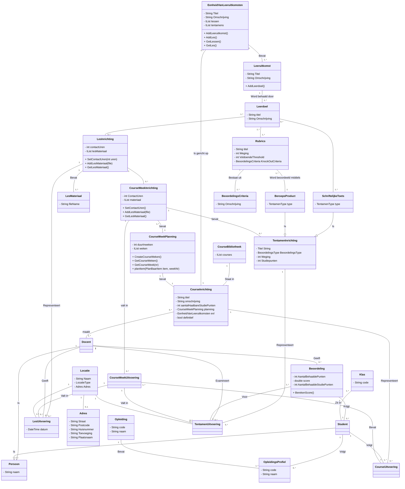
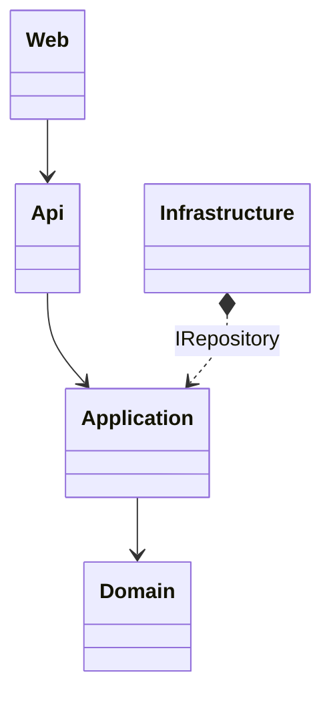

[Terug](/README.md)

---
:warning: **_NOTE:_**
Belangrijk voor het gehele document:

- Moet consistent zijn met FO!
- Indien binnen code afwekend wordt van TO moet dit grondig onderbouwd zijn.

---

# Technisch Ontwerp

**Opdrachtgever:** De HAN - Hoge School Arnhem Nijmegen</br>
**Datum**: 12-11-2022 </br>
**Studenten**: Thomas Hofman (622438), Ricardo de Wijs ({studentnr})</br>
**Versie**: v0.2 </br>
**Klas**: {klascode} </br>
**Locatie**: Arnhem
**Docent**: John Gorter

# Versiebeheer

|Versie|Beschrijving|Auteur|Datum|
|------|------------|------|-----|
|v0.1|Document opzet & inleidingen|Thomas Hofman|16-09-2022|
|v0.2|Converteren van docx naar markdown|Thomas Hofman|12-11-2022|
|v0.3|Concept H4, H5|Thomas Hofman|12-11-2022|

# Inhoudsopgave

1. [Inleiding](#1-inleiding) </br>
    1.1. [Aanleiding](#11-aanleiding) </br>
    1.2. [Doelstelling](#12-doelstelling) </br>
    1.3. [Doelgroep](#13-doelgroep) </br>
2. [Aanpak & Prioritering](#2-aanpak--prioritering) </br>
3. [Design](#3-design) </br>
    3.1. [Class Diagram](#31-class-diagram) </br>
        3.1.1. [Toelichting](#311-toelichting) </br>
    3.2. [Ontwerp keuzes](#32-onderbouwing-ontwerp-keuzes) </br>
        3.2.1. [GoF Patterns](#321-gof-patterns) </br>
        3.2.2. [GRASP Principes](#322-graspsolid-principes) </br>
    3.3. [Relatie tot domein model](#33-relatie-tot-domein-model) </br>
4. [Architectuur](#4-architectuur) </br>
    4.1. [Layering](#41-layering) </br>
    4.2. [Distribution](#42-distribution) </br>
    4.3. [Architectuur Patterns](#43-architectuur-patterns) </br>
5. [Overige](#5-technische-keuzes) </br>
    5.1. [Frameworks & Libraries](#51-framworks--libraries) </br>
    5.2. [Versiebeheer](#52-versiebeheer) </br>
    5.3. [Build Management (CI/CD)](#53-build-management-cicd) </br>
    5.4. [Unit-, Integratie- Tests](#54-unit--integratie--tests) </br>
6. [Bronnen](#6-bronnen)

# 1. Inleiding

## 1.1. Aanleiding

## 1.2. Doelstelling

## 1.3. Doelgroep

- Technische mensen

<font size="1">[:point_up_2: [Inhoudsopgave](#inhoudsopgave)]</font>

# 2. Aanpak & Prioritering

---
:warning: **_NOTE:_**
must-have functionaliteit volledig zoals gespecificeerd voor een 8 een paar should haves voor een 10

---

1. Eerst de inrichting kant van de domein laag uitwerken
    - Voor iedere methode ook direct de test schrijven in test project
2. De uitwerking kant van de domein laag uitwerken
    - Wederom denk aan de tests
3. Ieders zijn complexe use case uitwerken in applicatie laag.
4. repo interface in applicatie uitwerken
5. repo interface implementeren
    - Dependency naar domain laag: types uit domein laag gebruiken, mapping voorkomen.
    - met in memory data (niet teveel tijd in steken)
    - of met EF CORE?
6. Api zo uitwerken dat je de complexe use cases via de swagger gui kan testen
7. Tijd over, een los web project maken met eigen user interface
    - of plain javascript, ajax, bootstrap
    - of angular met material UI.
8. Heel veel tijd over?
    1. overige crud use cases uitwerken
    2. Authenticatie implementeren via AzureAD

<font size="1">[:point_up_2: [Inhoudsopgave](#inhoudsopgave)]</font>

# 3. Design

## 3.1. Class Diagram



---
:warning: **_CRITERIA:_**
Correct toepassen standaard notatie en het diagram moet de volledig requirements afdekken.

---

### 3.1.1 Toelichting

---
:warning: **_CRITERIA:_**
Minimaal 1 extra diagram (geen class diagram) opnemen, diverse modellen vereist voor een 8

---

## 3.2 Onderbouwing ontwerp keuzes

---
:warning: **_CRITERIA:_**
Ontwerp problemen identificeren en ontwerp keuzes onderbouwen met relevant alternatieven en overwegingen voor een 10

---

### 3.2.1. GoF Patterns

---
:warning: **_CRITERIA:_**
een variatie aan principes en patterns op correcte en onderbouwde manier toegepast voor een 10

---

### 3.2.2. GRASP/SOLID Principes

---
:warning: **_CRITERIA:_**
een variatie aan principes en patterns op correcte en onderbouwde manier toegepast voor een 10

---

## 3.3. Relatie tot domein model

Wijzigingen ten opzichte van domein model

---
:warning: **_CRITERIA:_**
Zowel inconsistenties als consistenties benoemd, inconsistenties volledig van relevante, onderbouwde verbetervoorstellen voorzien voor een 10

---

<font size="1">[:point_up_2: [Inhoudsopgave](#inhoudsopgave)]</font>

# 4. Architectuur

Domain-centric architecture: Clean Architecture

```raw
.
├── _HICT.ICDETool.Application --> Application > Stuurt het domein aan
|   └── _Interfaces
|       ├── Repositiries > Interfaces voor persisitentie
|       └── Services > Interfaces voor andere infrastructurele benodigdheden
├── HICT.ICDETool.SharedKernel --> Shared kernel > gebruikt in meerdere projecten, zoals value objects
├── HICT.ICDETool.Domain --> Domain logic > Domein werkt op zichzelf, en beheert eigen consistentie.
├── HICT.ICDETool.Infrastructure --> Implementatie van applicatie interfaces voor persistentie en services (onder andere EF CORE)
├── HICT.ICDETool.Api (entrypoint) --> Presentatie logica only, aanbieden van een rest api en deze aansturen middels swagger 
├── HICT.ICDETool.Tests (entrypoint voor tests)

.
└── HICT.ICDETool.Web --> (minste prio) Losse MVC app: het aanbieden van een javascript webapp die de swagger api consumeert.
```



## 4.1. Layering

## 4.2. Distribution

- Geen microservices

## 4.3. Architectuur Patterns

---
:warning: **_CRITERIA:_**
een variatie aan principes en patterns op correcte en onderbouwde manier toegepast voor een 10

---

<font size="1">[:point_up_2: [Inhoudsopgave](#inhoudsopgave)]</font>

# 5. Technische keuzes

- .NET 6 / C#10
- ORM framework: EF Core 6
- Presentatie framework: MVC
- Ardalis https://github.com/ardalis/Specification
- Swagger
- Frontend: Javascript/Ajax/Jquery/Bootstrap 5
- Project management: github projects
- Dependency Injection via host builder
- Configuration Management (IConfiguration)
- Database: MSSQL

Eventueel:

- Angular

<font size="1">[:point_up_2: [Inhoudsopgave](#inhoudsopgave)]</font>

## 5.1. Framworks & Libraries

---
:warning: **_CRITERIA:_**
alle frameworks, framework onderdelen en libraries correct gebruikt en volledig geïntegreerd, keuze voor deze onderbouwd voor een 10

---

## 5.2. Versiebeheer

- Version management: github repos

---
:warning: **_CRITERIA:_**
versiebeheer en build management toegepast voor een 10

---

## 5.3. Build Management (CI/CD)

- Build management: github actions
- CI --> build artifacts
- Runs tests
- CD --> build docker container & upload to repo

---
:warning: **_CRITERIA:_**
versiebeheer en build management toegepast voor een 10

---

## 5.4. Unit-, Integratie- Tests

- Test Framework: xUnit

---
:warning: **_CRITERIA:_**
unit- en integratietests dekken werking grotendeels af, werking gedemonstreerd voor een 10

---

<font size="1">[:point_up_2: [Inhoudsopgave](#inhoudsopgave)]</font>

# 6. Bronnen

|APA Bronvermelding|
|------------------|
|{clean architecture}
|{DDD}
|{Pluralsight courses}
|{refactoring guru}

<font size="1">[:point_up_2: [Inhoudsopgave](#inhoudsopgave)]</font>