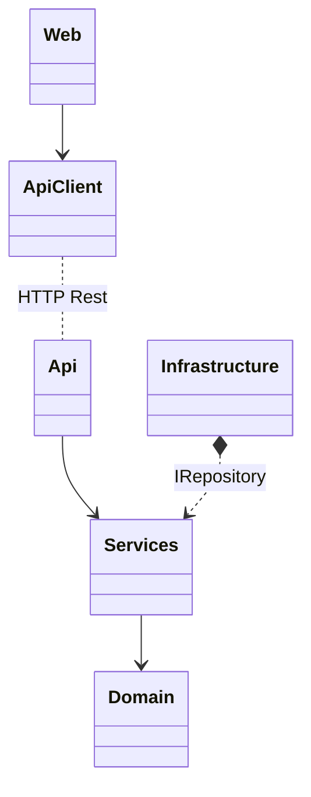
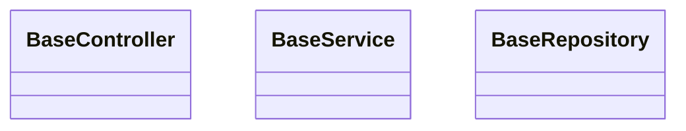
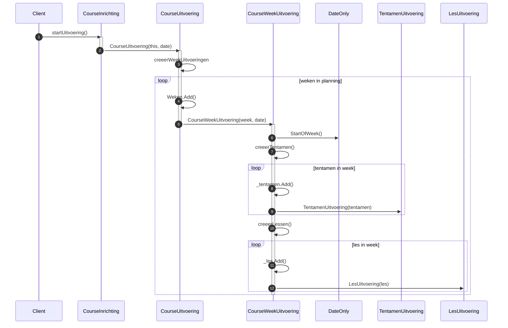
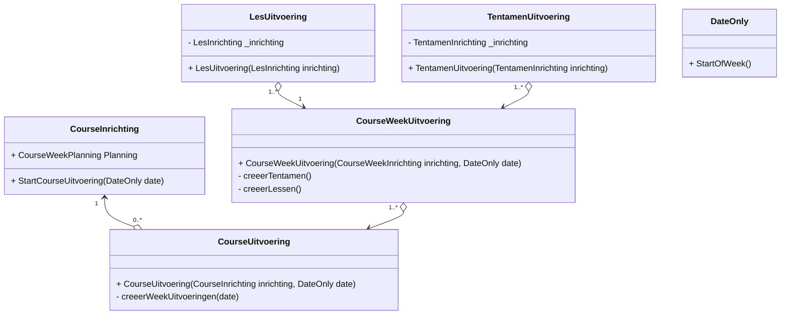

[Terug](/README.md)

# Technisch Ontwerp

**Opdrachtgever:** De HAN - Hoge School Arnhem Nijmegen</br>
**Datum**: 12-11-2022 </br>
**Studenten**: Thomas Hofman (622438), Ricardo de Wijs ({studentnr})</br>
**Versie**: v0.2 </br>
**Klas**: {klascode} </br>
**Locatie**: Arnhem
**Docent**: John Gorter

# Versiebeheer

|Versie|Beschrijving|Auteur|Datum|
|------|------------|------|-----|
|v0.1|Document opzet & inleidingen|Thomas Hofman|16-09-2022|
|v0.2|Converteren van docx naar markdown|Thomas Hofman|12-11-2022|
|v0.3|Concept H4, H5|Thomas Hofman|12-11-2022|
|v0.4|H2, H3|Thomas Hofman|30-12-2022|

# Inhoudsopgave

1. [Inleiding](#1-inleiding) </br>
    1.1. [Aanleiding](#11-aanleiding) </br>
    1.2. [Doelstelling](#12-doelstelling) </br>
    1.3. [Doelgroep](#13-doelgroep) </br>
2. [Aanpak & Prioritering](#2-aanpak--prioritering) </br>
3. [Architectuur](#3-architectuur) </br>
    3.1. [Layering](#31-layers) </br>
    3.2. [Distribution/Scalability](#32-distributionscalability) </br>
    3.3. [Architectuur Patterns](#33-architectuur-patterns) </br>
4. [Technische keuzes](#4-technische-keuzes)
5. [Design](#5-design) </br>
    5.1. [Api, Repository & Service Design](#51-api-repository--service-design) </br>
    5.2. [Domein Design](#52-domein-design) </br>
        5.2.1. [Toelichting](#521-toelichting) </br>
        5.2.2. [Domein consistentie/inconsistentie](#522-domein-consistentieinconsistentie) </br>
    5.3. [UC15 - Start uitvoering](#53-uc-15-start-uitvoering) </br>
        5.3.1. [Design](#531-design) </br>
        5.3.2. [Toelichting](#532-toelichting) </br>
    5.4. [UC-18 Exporteer Informatie](#54-uc-18-exporteer-informatie) </br>
        5.4.1. [Design](#541-design) </br>
        5.4.2. [Toelichting](#542-toelichting) </br>
6. [Overige](#6-overige) </br>
    6.1. [Versiebeheer](#61-versiebeheer) </br>
    6.2. [Build Management (CI/CD)](#62-build-management-cicd) </br>
    6.3. [Unit-, Integratie- Tests](#63-unit--integratie--tests) </br>
7. [Bronnen](#7-bronnen)

# 1. Inleiding

## 1.1. Aanleiding

## 1.2. Doelstelling

## 1.3. Doelgroep

- Technische mensen

<font size="1">[:point_up_2: [Inhoudsopgave](#inhoudsopgave)]</font>

# 2. Aanpak & Prioritering

Het project zal iteratief opgeleverd worden wat betekent dat er steeds nieuwe functionaliteit toegevoegd word aan het project en dat er tussentijds werkende versies opgeleverd worden. Voordat er werkende versies opgeleverd kunnen worden die voor de klant testbaar zijn dient er een minimum viable product (MVP)ogezet te worden. In onderstaande staat beschreven volgens welke stappen dit MVP opgezet word:

1. Eerst dient de domein laag, het core project, uitgewerkt te worden, attributen moeten bepaald worden en relaties tussen attributen moeten gedefineerd worden (middels attributen).
2. Vervolgens dient voor ieder van deze domein entiteiten creatie logica aangebracht te worden. Iedere entiteit moet gecreeerd kunnen worden inclusief bijhorende afhankelijkheden. Belangrijk is dat entiteiten via de constructor aangemaakt worden zodat vereiste parameters/data afgedwongen kan worden. Essentieel is dat deze logica getest word middels unit testen.
3. Nu de domein laag uitgewerkt is moet deze persistent opgeslagen kunnen worden. De service laag waarvan de presentatie laag (api) afhankelijk is op zijn beurt weer afhankelijk van een repository implementatie. Deze implementatie dient uitgewerkt te worden zodat alle domein data persistent opgeslagen kan worden. 
4. Nu er een repository implementatie beschikbaar is kan de service laag uitgewerkt worden en vervolgens de presentatie laag uitgewerkt worden. 

Middels swagger is het mogelijk om via een grafisch web interface de api te testen, voldoende om toekomstige iteratief toegevoegde functionaliteit af te testen. In totaal zijn er 22 use cases in kaart gebracht, uit deze 22 use cases hebben wij 5 use cases als "complex" bestempelt, deze use cases zullen als eerst geimplementeerd worden aangezien het succes van het project valt of staat met de uitwerking van deze use cases. De complexe use cases zijn als volgt:

1. UC-2 Bekijk Beoordelingen
2. UC-18 Exporteer informatie
3. UC-15 Start uitvoering
4. UC-16 Maak course definitief
5. UC-20 Aanmelden

Deze use cases dienen in bovenstaande volgorde opgeleverd te worden, de functionaliteit kan iteratief toegevoegd worden aan het bestaande MVP. Ook technisch ontwerp is onderdeel van onze iteratieve werkwijze om een grote voorafgaande documentatie effort te voorkomen, na mate het project vordert zal ook aan de overige use cases een prioriteit toegekend worden. 

<font size="1">[:point_up_2: [Inhoudsopgave](#inhoudsopgave)]</font>

# 3. Architectuur

In onderstaande word de architectuur van de applicatie toegelicht, applicatie architectuur betreft het defineren van wat er in de applicatie zit en hoe deze componenten zich tot elkaar verhouden/met elkaar integreren. In een later hoofdstuk zal het design van deze componenten toegelicht worden.  

# 3.1. Layers

In de achitectuur die binnen dit project gehanteerd staat het domein centraal, het domein bestaat uit verschillende entiteiten deze zijn gehuisvestigd in het `HICT.ICDETool.Core` project, het core project is de domein laag. De domeinlaag houd zich alleen bezig met domein logica, elke entiteit representeert een concept uit het domein model en bevat de benodigde methodes om de staat van het domein te wijzigen, dit is de domein logica. 

Afhankelijk van het core project is het `HICT.ICDETool.Service` project, het service project heeft interactie met het project middels services. De rol van de service laag is het verbinden van de domein laag met de technische lagen zoals de infrastructuur laag en eventuele andere externe diensten. Het verbinden met deze lagen/diensten gebeurd via interfaces, de service laag defineert de interfaces en is zich niet bewust van de implementatie. Het is aan de daadwerkelijke implementatie om zich te conformeren aan deze interface. Dit principe heet dependency injecten en voorkomt dat de service laag direct gekoppelt word aan een implementatie. Dit zal het anders namelijk maken om later te wijzigen van implementatie of een mock implementatie te gebruiken voor unit testen.

De infrastructuur laag houdt zich bezig met infrastructurele zaken en bevind zich in het `HICT.ICDETool.Infratructuur`, binnen deze applicatie betreft dit alleen de data persistentie. De infrastructuur laag bevat een repository implementatie die die repository interface gedefineerd in de service laag implementeert.

De service laag wordt geconsumeerd door de presentatie laag, in dit geval betreft dit een HTTP rest API, deze is gehuisvestigd in het `HICT.ICDETool.Api` project. Deze laag maakt het mogelijk voor eindgebruiker of externe systemen om data uit het systeem te consumeren en hier bewerkingen op uit te voeren. In dit geval middel HTTP rest calls. 

De tot projecten/lagen die tot nu toe ten spraken zijn gekomen zijn allemaal aanwezig aan de server zijde. Een eindgebruiker zal echter niet direct met de API communiceren en verwacht een gebruikers interface. Deze interface bevind zich in het `HICT.ICDETool.Web` project, dit project is afhankelijk van het `HICT.ICDETool.ApiClient` project. De ApiClient bevat de daadwerkelijke logica om met de api te communiceren het web project bevat slechts de logica voor de presentatie daarvan. Het api client project is afhankelijk van het `HICT.ICDETool.Service` project, dit project zal namelijk de daadwerkelijke data transfer objects (DTO's) bevatten. 

Dan resten nog de projecten `HICT.ICDETool.SharedKernel`, `HICT.ICDETool.Tests.Unit` en `HICT.ICDETool.Tests.Integratie`. Het shared kernel project bevat logica die overkoepelend is voor de gehele applicatie. Het doel van de test projecten is om geautomatiseerde testen te schrijven zodat het eenvoudig is om herhaaldelijk te testen of de applicatie nog steeds de verwachte uitkomst genereert. Unit testen zullen in dit geval gericht voornamelijk gericht zijn op de werking van de domein laag, deze testen zijn onafhankelijk en kunnen dus zonder de benodigdheid van externe services draaien. De integratie testen richten zich juist op de integratie met externe services, in dit geval zal de werking van de api client getest worden, de externe service waarvan deze afhankelijk is is het api project.

Naar deze architectuur waarbij het domein centraal staat word verwezen als Clean Architecture. Clean Architecture is een vorm van Domain Centric design en is relatief toegankelijk. Er zijn andere vormen van Domain Centric design zoals Onion, Hexagonal en Domein Driven Design (DDD). Het gebruik van meerdere lagen maakt bepaalde aspecten van de applicatie herbruikbaar en bied richtlijnen in het onderverdelen van logica. 

```raw
.
├── HICT.ICDETool.Service
├── HICT.ICDETool.SharedKernel 
├── HICT.ICDETool.Domain 
├── HICT.ICDETool.Infrastructure 
├── HICT.ICDETool.Api
├── HICT.ICDETool.Tests.Unit
├── HICT.ICDETool.Tests.Integration 
├── HICT.ICDETool.ApiClient
└── HICT.ICDETool.Web 
```



## 3.2. Distribution/Scalability

De oplossing is gebaseerd op een client-server architectuur waarbij de client het web project is en de server side applicatie het api project is. De applicatie staat haar data persistent op in een relationele database. De web client word gedownload door de browser zodra men de webserver waar deze client op gehost word aanroept. Het voordeel van het gebruik van een aparte web client is dat niet voor iedere wijziging in de presentatie een http request vereist is. De web client kan een request doen naar de api server en vervolgens zelfstandig deze data presenteren in verschillende vormen, dit verminderd de load op de api server en ook op de daarbij horende database en verplaatst deze naar de client.

Er zijn dus 3 componenten die gehost dienen te worden, de web client moet aangeboden worden, de api dient beschikbaar te zijn en de api is afhankelijk van een database. Deze zijn ieders horizontaal (toevoegen van servers) als verticaal (toevoegen van resources) schaalbaar. Zo kan tegemoet gekomen worden aan de gestelde niet functionele requirements omtrent load en beschikbaarheid.

## 3.3. Architectuur Patterns

Binnen de applicatie word er gebruik gemaakt van een aantal  architectuur patterns, deze patterns hebben in grote impact op de structuur van de applicatie en worden in onderstaande toegelicht.

- Controller: Het Api project is een MVC project echter bevat het alleen controllers, iedere domein entiteit krijgt haar eigen controller. Middels URL routing word de request door de juiste controller opgevangen, de controller vraagt de service laag om de lees of schrijf bewerking uit te voeren en geeft vervolgens het resultaat (indien van toepassing) terug aan de eindgebruiker.
- Data transfer objects (DTO's): Data transfer objects zijn objecten geoptimaliseerd voor data communicatie, zo kan een DTO meer data bevatten dan normaal voor een view benodigd zal zijn. Door een web client via een DTO meer van meer informatie te voorzien kan een client langer zonder communicatie met de api server.
- Repository: Voor toegang tot data word een repository gebruikt, een repository is een abstractie voor de data persistentie laag en is verantwoordelijk voor de afhandeling van alle taken omtrent deze persistentie. Zo kan de applicatie met persistente data interacteren alsof het onderdeel is van de applicatie zelf terwijl het afkomstig uit uit een externe service namelijk een RDBMS.
- Specification: Het specification pattern maakt het mogelijk om database verzoeken vast te leggen in een aparte specificatie class. Deze class kan aan de repository meegegeven worden die vervolgens dit database verzoek uitvoert. Het gebruik van aparte specificatie classes maakt het mogelijk om data verzoeken onder te brengen in de domein laag en deze specificaties eenvoudig te herbruiken.
- Dependency Injection: Dependency injection maakt het mogelijk een type service eenmalig te registreren bij het opstarten van de applicatie zodat deze @ runtime geinjecteert kunnen worden via de constructuctor van een class. Dit voorkomt dat je zelf deze classes moet instanteren, middels de registratie is de applicatie namelijk op de hoogte van hoe deze geinstantieert moet worden en kan dit @ runtime voor je doen.
- Dependency Inversion: Dependency inversion keert een afhankelijkheid om door het gebruik van een interface. Dit doe je door een interface te specificeren voor de implementatie waarvan je onafhankelijk wilt zijn en de imlpementatie deze interface laat implementeren. Dit maakt het mogelijk om eenvoudig tussen implementaties te wisselen zo lang deze de gespcifieerde interface implementeren.
- Client-Server: Zoals eerder benoemd hanteert de applicatie een client-server architectuur. Dit verplaatst de load van het renderen van de html naar de client en verminderd (indien juist toegepast) de load naar de api server.
- Data Binding: Bij data binding word een bepaald component in de grafische interface direct verbonden aan een data variabele. Wanneer de data variabele wijzigt zal het component zich opnieuw renderen. Dit voorkomt dat een pagina geheel moet herladen en creeert een dynamische web ervaring.

<font size="1">[:point_up_2: [Inhoudsopgave](#inhoudsopgave)]</font>

## 4. Technische keuzes

- .NET 6 / C#10
- ORM framework: EF Core 6
- Presentatie framework: MVC
- Swagger
- Ardalis repsistory
- Frontend: Javascript/Ajax/Jquery/Bootstrap 5
- Project management: github projects
- Dependency Injection via host builder
- Configuration Management (IConfiguration)
- Database: MSSQL
- Blazor

---
:warning: **_CRITERIA:_**
alle frameworks, framework onderdelen en libraries correct gebruikt en volledig geïntegreerd, keuze voor deze onderbouwd voor een 10

---

<font size="1">[:point_up_2: [Inhoudsopgave](#inhoudsopgave)]</font>

# 5. Design

## 5.1. Api, Repository & Service Design



## 5.2. Domein Design

```mermaid
classDiagram

class Adres{
    + Id : int
    + Straat : string
    + Huisnummer : string
    + Toevoeging : string
    + Postcode : string
    + Plaatsnaam : string
    + Adres(Id : int, Straat : string, Huisnummer : string, Postcode : string, Plaatsnaam : string, Toevoeging : string = null)
}

class Beoordeling{
    + Id : int
    + Beoordeling(tentamenUitvoering : TentamenUitvoering, beoordelingVoor : Student,  beoordeeldDoor : Docent)
}
Beoordeling --> Student : BeoordelingVoor
Beoordeling --> Docent : BeoordeeldDoor

class BeoordelingsCriteria{
    + Id : int
    + Omschrijving : string
    + BeoordelingsCriteria(omschrijving : string)
}

class BeroepsProduct{
    + Id : int
    + Titel : string
    + Weging : int 
    + TeBehalenStudiepunten : int 
    + BeroepsProduct(titel : string)
    + void AddRubrics(rubric : Rubric)
    + void RemoveRubrics(rubric : Rubric)
}
BeroepsProduct <--* Rubric : Rubrics
BeroepsProduct -- TentamenType : TentamenType
BeroepsProduct *--> CourseInrichting
BeroepsProduct --|> TentamenInrichting

class CourseBibliotheek{
    + void AddCourse(courseInrichting : CourseInrichting)
    + void RemoveCourse(courseInrichting : CourseInrichting)
}
CourseBibliotheek <--* CourseInrichting : Courses

class CourseInrichting {
    + int Id
    + string Titel
    + string Omschrijving
    + Docent AangemaaktDoor
    + CourseWeekPlanning Planning
    + bool IsDefinitief = false
    + DateTimeOffset AanmaakDatum
    - DateTimeOffset _aanmaakDatum
    + CourseInrichting(title : string, omschrijving : string, aangemaaktDoor : Docent)
    + void MaakDefinitief()
    + void AddEenheidVanLeeruitkomsten(eenheidVanLeeruitkomsten : EenheidVanLeeruitkomsten)
    + void RemoveEenheidVanLeeruitkomsten(eenheidVanLeeruitkomsten : EenheidVanLeeruitkomsten)
    + void AddBeroepsProduct(beroepsProduct : BeroepsProduct)
    + void RemoveBeroepsProduct(beroepsProduct : BeroepsProduct)
    + void AddToets(toets : SchriftelijkeToets)
    + void RemoveToets(toets : SchriftelijkeToets)
    + void AddLes(lesInrichting : LesInrichting)
    + void RemoveLes(lesInrichting : LesInrichting)
    + void CreatePlanning(duur : ITijdDefinitie)
    + void RemovePlanning()
    + CourseUitvoering StartCourseUitvoering(DateTimeOffset)
}
CourseInrichting <--* CourseWeekPlanning : Planning
CourseInrichting -- ITijdDefinitie
CourseInrichting <--* EenheidVanLeeruitkomsten : Evls
CourseInrichting <--* BeroepsProduct : BeroepsProducten
CourseInrichting <--* SchriftelijkeToets : Toetsen
CourseInrichting <--* LesInrichting : Lessen

class CourseUitvoering {
    + Id : int
    + StartDatum : DateTimeOffset
    - _startDatum : DateTimeOffset
    - void creeerWeekUitvoeringen()
}
CourseUitvoering *--> CourseInrichting : CourseInrichting
CourseUitvoering <--* CourseWeekUitvoering : Weken

class CourseWeekInrichting{
    + int Id
    + void AddSchriftelijkeToets(schriftelijkeToets : SchriftelijkeToets)
    + void RemoveSchriftelijkeToets(schriftelijkeToets : SchriftelijkeToets)
    + void RemoveBeroepsProduct(beroepsProduct : BeroepsProduct)
    + void RemoveBeroepsProduct(beroepsProduct : BeroepsProduct)
    + void RemoveLes(les : LesInrichting)
    + void RemoveLes(les : LesInrichting)
}
CourseWeekInrichting <--* SchriftelijkeToets : SchriftelijkeToets 
CourseWeekInrichting <--* BeroepsProduct : BeroepsProduct
CourseWeekInrichting <--* LesInrichting : LesInrichting

class CourseWeekPlanning{
    + int Id
    + CourseWeekPlanning(duur : ITijdDefinitie)
    - void vulPlanningMetWeken()
}
CourseWeekPlanning --> ITijdDefinitie : Duur
CourseWeekPlanning <--* CourseWeekInrichting : Weken

class CourseWeekUitvoering{
    + int Id
    + DateTimeOffset Maandag
    + CourseWeekUitvoering(date : DateTimeOffset, courseWeekInrichting : CourseWeekInrichting)
    - void creeerTentamenUitvoeringen()
    - void creeerLesUitvoeringen()
}
CourseWeekUitvoering *--> CourseWeekInrichting : CourseWeekInrichting
CourseWeekUitvoering --> TentamenUitvoering : Tentamen
CourseWeekUitvoering --> LesUitvoering : Lessen

class Docent {
    + Docent(voornaam : string, achternaam : string, email : string)
}
Docent --|> Persoon

class EenheidVanLeeruitkomsten{
    + int Id
    + string Titel
    + string Omschrijving
    + EenheidVanLeeruitkomsten(titel : string, omschrijving : string)
    + void AddLeeruitkomst(Leeruitkomst)
    + void RemoveLeeruitkomst(Leeruitkomst)
}
EenheidVanLeeruitkomsten <--* Leeruitkomst : Leeruitkomsten

<<Interface>> ITijdDefinitie
class ITijdDefinitie{
    + int DuurInWeken
    + int TeBehalenStudiepunten
}

class Klas{
    + int Id
    + string Code
    + void AddStudent(Student)
    + void RemoveStudent(Student)
}
Klas --> Docent : Mentor
Klas --> Student : Studenten

class Leerdoel{
    + int Id
    + string Titel
    + string Omschrijving
    + Leerdoel(titel : string, omschrijving : string)
    + void KoppelRubrics(Rubric)
    + void OntkoppelRubric(Rubric)
    + void KoppelLes(LesInrichting)
    + void OntkoppelLes(LesInrichting)
    + void KoppelToets(SchriftelijkeToets)
    + void OntkoppelToets(SchriftelijkeToets)
}
Leerdoel --> Rubric : GekoppeldeRubrics
Leerdoel --> LesInrichting : GekoppeldeLessen
Leerdoel --> SchriftelijkeToets : GekoppeldeToetsen

class Leeruitkomst{
    + int Id
    + string Titel
    + string Omschrijving
    + Leeruitkomst(titel : string, omschrijving : string)
    + void KoppelLeerdoel(Leerdoel)
    + void OntkoppelLeerdoel(Leerdoel)
}
Leeruitkomst --> Leerdoel : Leerdoelen

class LesInrichting{
    + int Id
    + string Titel
    + LesInrichting(titel : string)
    + void AddLesMateriaal(LesMateriaal)
    + void RemoveLesMateriaal(LesMateriaal)
}
LesInrichting --> LesMateriaal : LesMateriaal
LesInrichting --|> Validator

class LesMateriaal{
    + int Id
    + LesMateriaal()
    - IList<LesMateriaalLine> genereerInhoud()
}
LesMateriaal --> LesMateriaalLine : Inhoud

class LesMateriaalLine{
    + int Id
    + string Line
    + LesMateriaalLine(line: string)
}

class LesUitvoering{
    + int Id
    + LesUitvoering(lesInrichting : LesInrichting)
}
LesUitvoering *--> LesInrichting : LesInrichting
LesUitvoering --> Docent : Docent
LesUitvoering --> Locatie : Locatie

class Locatie{
    + int Id
    + string Naam
    + Locatie(naam : string, locatieType : string)
}
Locatie -- LocatieType : LocatieType
Locatie --> Adres : Adres

<<Enumeration>> LocatieType

class Opleiding{
    + int Id
    + string Naam
    + string Code
    + Opleiding(naam : string, code : string)
    + void AddOpleidingsProfiel(OpleidingsProfiel)
    + void RemoveOpleidingsProfiel(OpleidingsProfiel)
}
Opleiding <--* OpleidingsProfiel : OpleidingsProfiel



class OpleidingsProfiel{
    + int Id
    + string Naam
    + string Code
    + OpleidingsProfiel(naam : string, code : string)
}

class Periode
Periode --|> ITijdDefinitie

<<interface>> Persoon
class Persoon {
    + string Voornaam
    + string Achternaam
    + string Email
}

class Rubric {
    + int Id
    + string Titel
    + int Weging = 0
    + int VoldoendeThreshold = 0
    + int KnockoutThreshold = 0
    + Rubric(titel : string)
    + void AddBeoordelingsCriteria(BeoordelingsCriteria)
    + void RemoveBeoordelingsCriteria(BeoordelingsCriteria)
}
Rubric <--* BeoordelingsCriteria : BeoordelingsCriteria
Rubric --|> Validator

class SchriftelijkeToets {
    + SchriftelijkeToets(titel : string)
}
SchriftelijkeToets --> CourseInrichting
SchriftelijkeToets --|> TentamenInrichting
SchriftelijkeToets --|> Validator

class Semester
Semester --|> ITijdDefinitie

class Student{
    + OpleidingsProfiel VolgtProfiel
    + CourseUitvoering VolgCourse
    + Student(voornaam : string, achternaam : string, email : string)
}
Student --|> Persoon
Student --> OpleidingsProfiel
Student --> CourseUitvoering


<<interface>> TentamenInrichting
class TentamenInrichting{
    + int Id
    + string Titel
    + TentamenType Type
    + int Weging
    + int TeBehalenStudiepunten
}
TentamenInrichting -- TentamenType : Type

<<Enumeration>> TentamenType

class TentamenUitvoering{
    + Id : int
    + TentamenUitvoering(schriftelijkeToets : SchriftelijkeToets)
    + TentamenUitvoering(beroepsProduct : BeroepsProduct)
}
TentamenUitvoering --> SchriftelijkeToets
TentamenUitvoering --> BeroepsProduct
TentamenUitvoering --> Locatie
TentamenUitvoering --> Docent

<<interface>> Validator
class Validator{
    + Validate()
}

```



---
:warning: **_CRITERIA:_**
Correct toepassen standaard notatie en het diagram moet de volledig requirements afdekken.

---

### 5.2.1 Toelichting

---
:warning: **_CRITERIA:_**
Minimaal 1 extra diagram (geen class diagram) opnemen, diverse modellen vereist voor een 8

---

### 5.2.2. Domein consistentie/inconsistentie

- persoon
- additionele interface

---
:warning: **_CRITERIA:_**
Zowel inconsistenties als consistenties benoemd, inconsistenties volledig van relevante, onderbouwde verbetervoorstellen voorzien voor een 10

---

## 5.3 UC-15 Start Uitvoering

---
:warning: **_CRITERIA:_**
Ontwerp problemen identificeren en ontwerp keuzes onderbouwen met relevant alternatieven en overwegingen voor een 10

---

---
:warning: **_NOTE:_**
een variatie aan principes en patterns op correcte en onderbouwde manier toegepast voor een 10

---

### 5.3.1. Design





---
:warning: **_NOTE:_**
Class Diagram en/of sequence diagram toegespitst op de use case.

---

### 5.3.2. Toelichting

---
:warning: **_NOTE:_**
Toelichten van gebruikte GoF patterns, SOLID principes & GRASP principes.

---

<font size="1">[:point_up_2: [Inhoudsopgave](#inhoudsopgave)]</font>

## 5.4 UC-18 Exporteer Informatie

---
:warning: **_CRITERIA:_**
Ontwerp problemen identificeren en ontwerp keuzes onderbouwen met relevant alternatieven en overwegingen voor een 10

---

---
:warning: **_NOTE:_**
een variatie aan principes en patterns op correcte en onderbouwde manier toegepast voor een 10

---

### 5.4.1. Design

### 5.4.2. Toelichting

---
:warning: **_NOTE:_**
Toelichten van gebruikte GoF patterns, SOLID principes & GRASP principes.

---


# 6. Overige

## 6.1. Versiebeheer

- Version management: github repos

---
:warning: **_CRITERIA:_**
versiebeheer en build management toegepast voor een 10

---

## 6.2. Build Management (CI/CD)

- Build management: github actions
- CI --> build artifacts
- Runs tests
- CD --> build docker container & upload to repo

---
:warning: **_CRITERIA:_**
versiebeheer en build management toegepast voor een 10

---

## 6.3. Unit-, Integratie- Tests

- Test Framework: xUnit

---
:warning: **_CRITERIA:_**
unit- en integratietests dekken werking grotendeels af, werking gedemonstreerd voor een 10

---

<font size="1">[:point_up_2: [Inhoudsopgave](#inhoudsopgave)]</font>

# 7. Bronnen

|APA Bronvermelding|
|------------------|
|{clean architecture}
|{DDD}
|{Pluralsight courses}
|{refactoring guru}

<font size="1">[:point_up_2: [Inhoudsopgave](#inhoudsopgave)]</font>