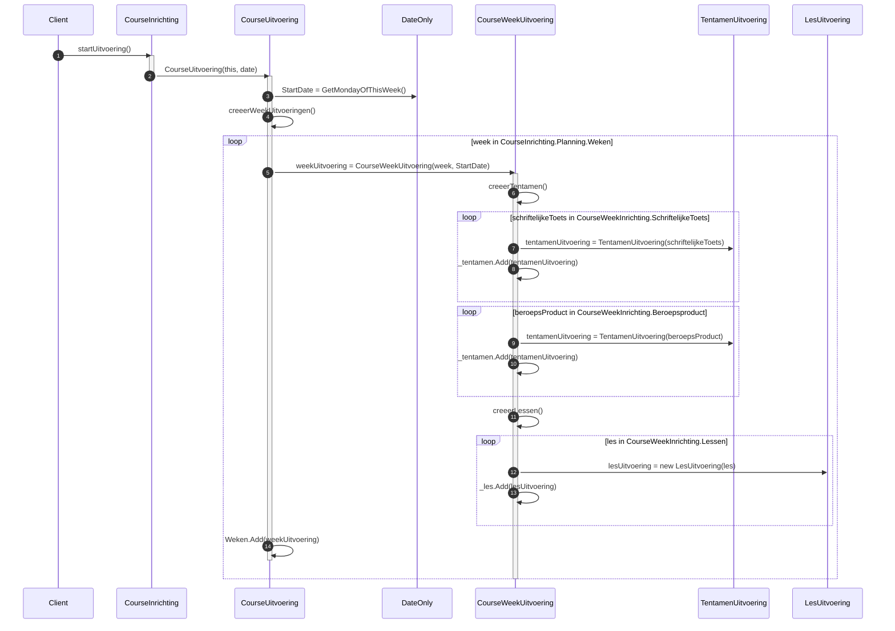
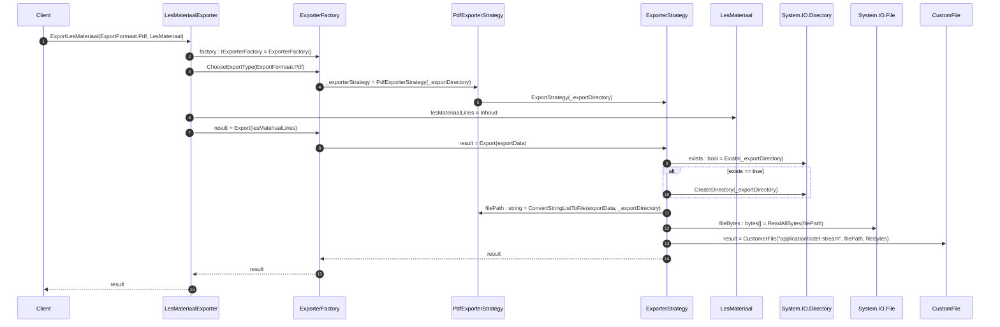
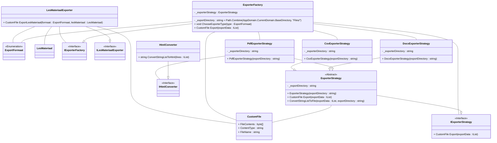

[Terug](/README.md)

# Technisch Ontwerp

**Opdrachtgever:** De HAN - Hoge School Arnhem Nijmegen</br>
**Datum**: 12-11-2022 </br>
**Studenten**: Thomas Hofman (622438), Ricardo de Wijs ({studentnr})</br>
**Versie**: v0.2 </br>
**Klas**: {klascode} </br>
**Locatie**: Arnhem
**Docent**: John Gorter

# Versiebeheer

|Versie|Beschrijving|Auteur|Datum|
|------|------------|------|-----|
|v0.1|Document opzet & inleidingen|Thomas Hofman|16-09-2022|
|v0.2|Converteren van docx naar markdown|Thomas Hofman|12-11-2022|
|v0.3|Concept H4, H5|Thomas Hofman|12-11-2022|
|v0.4|H2, H3|Thomas Hofman|30-12-2022|
|v0.5|H4|Thomas Hofman|31-12-2022|
|v0.5|H6|Thomas Hofman|31-12-2022|
|v0.6|H5.3, H5.4, H5.2|Thomas Hofman|31-12-2022|
|v0.7|H5.1, H5.1.1|Thomas Hofman|02-01-2023|
|v0.8|H5.3.1, H5.4.1|Thomas Hofman|03-01-2023|
|V0.9|H1, H1.1, H1.2, H1,3|Ricardo de Wijs|05-01-2023|

# Inhoudsopgave

1. [Inleiding](#1-inleiding) </br>
    1.1. [Aanleiding](#11-aanleiding) </br>
    1.2. [Doelstelling](#12-doelstelling) </br>
    1.3. [Doelgroep](#13-doelgroep) </br>
2. [Aanpak & Prioritering](#2-aanpak--prioritering) </br>
3. [Architectuur](#3-architectuur) </br>
    3.1. [Layering](#31-layers) </br>
    3.2. [Distribution/Scalability](#32-distributionscalability) </br>
    3.3. [Architectuur Patterns](#33-architectuur-patterns) </br>
4. [Technische keuzes](#4-technische-keuzes)
5. [Design](#5-design) </br>
    5.1. [Api, Repository & Service Design](#51-api-repository--service-design) </br>
        5.1.1. [Toelichting](#511-toelichting) </br>
    5.2. [Domein Design](#52-domein-design) </br>
        5.2.1. [Toelichting](#521-toelichting) </br>
    5.3. [UC15 - Start uitvoering](#53-uc-15-start-uitvoering) </br>
        5.3.1. [Toelichting](#531-toelichting) </br>
    5.4. [UC-18 Exporteer Informatie](#54-uc-18-exporteer-informatie) </br>
        5.4.1. [Toelichting](#541-toelichting) </br>
6. [Overige](#6-overige) </br>
    6.1. [Versiebeheer](#61-versiebeheer) </br>
    6.2. [Build Management (CI/CD)](#62-build-management-cicd) </br>
    6.3. [Unit-, Integratie- Tests](#63-unit--integratie--tests) </br>
7. [Bronnen](#7-bronnen)

# 1. Inleiding

Om het project technische te ondersteunen is na de eerste iteratie van het functionele ontwerp begonnen met het opstellen van dit technische ontwerp. Projectdocumentatie bestaat ten allertijden uit een technisch en een functioneel deel. Dit technische ontwerp waarborgt het technische deel van de projectdocumentatie. Bij het opstellen van dit document worden er rekening gehouden met de volgende zaken:

1. Technische modellen zijn consistent met de code en met het FO
2. Juiste modellen zijn toegepast
3. Modellen of technische uitwerking draagt bij en is geen onnodige document vulling

## 1.1. Aanleiding

Zoals eerder aangegeven bevat project documentatie een technisch deel daarbij dwingt
casusopdracht het schrijven van een technisch ontwerp af.

## 1.2. Doelstelling

Dit document beschrijft op basis van het functionele ontwerp de technische werking en samenhang van het oose-casus. Teven worden de technische keuzes onderbouwd en zullen de gebruikte technieken worden toegelicht. Ook dient dit document als naslag voor eventuele toekomstige uitbreidingen of aanpassingen.

## 1.3. Doelgroep

- Technische mensen

<font size="1">[:point_up_2: [Inhoudsopgave](#inhoudsopgave)]</font>

# 2. Aanpak & Prioritering

Het project zal iteratief opgeleverd worden wat betekent dat er steeds nieuwe functionaliteit toegevoegd word aan het project en dat er tussentijds werkende versies opgeleverd worden. Voordat er werkende versies opgeleverd kunnen worden die voor de klant testbaar zijn dient er een minimum viable product (MVP)ogezet te worden. In onderstaande staat beschreven volgens welke stappen dit MVP opgezet word:

1. Eerst dient de domein laag, het core project, uitgewerkt te worden, attributen moeten bepaald worden en relaties tussen attributen moeten gedefineerd worden (middels attributen).
2. Vervolgens dient voor ieder van deze domein entiteiten creatie logica aangebracht te worden. Iedere entiteit moet gecreeerd kunnen worden inclusief bijhorende afhankelijkheden. Belangrijk is dat entiteiten via de constructor aangemaakt worden zodat vereiste parameters/data afgedwongen kan worden. Essentieel is dat deze logica getest word middels unit testen.
3. Nu de domein laag uitgewerkt is moet deze persistent opgeslagen kunnen worden. De service laag waarvan de presentatie laag (api) afhankelijk is op zijn beurt weer afhankelijk van een repository implementatie. Deze implementatie dient uitgewerkt te worden zodat alle domein data persistent opgeslagen kan worden. 
4. Nu er een repository implementatie beschikbaar is kan de service laag uitgewerkt worden en vervolgens de presentatie laag uitgewerkt worden. 

Middels swagger is het mogelijk om via een grafisch web interface de api te testen, voldoende om toekomstige iteratief toegevoegde functionaliteit af te testen. In totaal zijn er 22 use cases in kaart gebracht, uit deze 22 use cases hebben wij 5 use cases als "complex" bestempelt, deze use cases zullen als eerst geimplementeerd worden aangezien het succes van het project valt of staat met de uitwerking van deze use cases. De complexe use cases zijn als volgt:

1. UC-2 Bekijk Beoordelingen
2. UC-18 Exporteer informatie
3. UC-15 Start uitvoering
4. UC-16 Maak course definitief
5. UC-20 Aanmelden

Deze use cases dienen in bovenstaande volgorde opgeleverd te worden, de functionaliteit kan iteratief toegevoegd worden aan het bestaande MVP. Ook technisch ontwerp is onderdeel van onze iteratieve werkwijze om een grote voorafgaande documentatie effort te voorkomen, na mate het project vordert zal ook aan de overige use cases een prioriteit toegekend worden. 

<font size="1">[:point_up_2: [Inhoudsopgave](#inhoudsopgave)]</font>

# 3. Architectuur

In onderstaande word de architectuur van de applicatie toegelicht, applicatie architectuur betreft het defineren van wat er in de applicatie zit en hoe deze componenten zich tot elkaar verhouden/met elkaar integreren. In een later hoofdstuk zal het design van deze componenten toegelicht worden.  

# 3.1. Layers

In de achitectuur die binnen dit project gehanteerd staat het domein centraal, het domein bestaat uit verschillende entiteiten deze zijn gehuisvestigd in het `HICT.ICDETool.Core` project, het core project is de domein laag. De domeinlaag houd zich alleen bezig met domein logica, elke entiteit representeert een concept uit het domein model en bevat de benodigde methodes om de staat van het domein te wijzigen, dit is de domein logica. 

Afhankelijk van het core project is het `HICT.ICDETool.Service` project, het service project heeft interactie met het project middels services. De rol van de service laag is het verbinden van de domein laag met de technische lagen zoals de infrastructuur laag en eventuele andere externe diensten. Het verbinden met deze lagen/diensten gebeurd via interfaces, de service laag defineert de interfaces en is zich niet bewust van de implementatie. Het is aan de daadwerkelijke implementatie om zich te conformeren aan deze interface. Dit principe heet dependency injecten en voorkomt dat de service laag direct gekoppelt word aan een implementatie. Dit zal het anders namelijk maken om later te wijzigen van implementatie of een mock implementatie te gebruiken voor unit testen.

De infrastructuur laag houdt zich bezig met infrastructurele zaken en bevind zich in het `HICT.ICDETool.Infratructuur`, binnen deze applicatie betreft dit alleen de data persistentie. De infrastructuur laag bevat een repository implementatie die die repository interface gedefineerd in de service laag implementeert.

De service laag wordt geconsumeerd door de presentatie laag, in dit geval betreft dit een HTTP rest API, deze is gehuisvestigd in het `HICT.ICDETool.Api` project. Deze laag maakt het mogelijk voor eindgebruiker of externe systemen om data uit het systeem te consumeren en hier bewerkingen op uit te voeren. In dit geval middel HTTP rest calls. 

De tot projecten/lagen die tot nu toe ten spraken zijn gekomen zijn allemaal aanwezig aan de server zijde. Een eindgebruiker zal echter niet direct met de API communiceren en verwacht een gebruikers interface. Deze interface bevind zich in het `HICT.ICDETool.Web` project, dit project is afhankelijk van het `HICT.ICDETool.ApiClient` project. De ApiClient bevat de daadwerkelijke logica om met de api te communiceren het web project bevat slechts de logica voor de presentatie daarvan. Het api client project is afhankelijk van het `HICT.ICDETool.Service` project, dit project zal namelijk de daadwerkelijke data transfer objects (DTO's) bevatten. 

Dan resten nog de projecten `HICT.ICDETool.SharedKernel`, `HICT.ICDETool.Tests.Unit` en `HICT.ICDETool.Tests.Integratie`. Het shared kernel project bevat logica die overkoepelend is voor de gehele applicatie. Het doel van de test projecten is om geautomatiseerde testen te schrijven zodat het eenvoudig is om herhaaldelijk te testen of de applicatie nog steeds de verwachte uitkomst genereert. Unit testen zullen in dit geval gericht voornamelijk gericht zijn op de werking van de domein laag, deze testen zijn onafhankelijk en kunnen dus zonder de benodigdheid van externe services draaien. De integratie testen richten zich juist op de integratie met externe services, in dit geval zal de werking van de api client getest worden, de externe service waarvan deze afhankelijk is is het api project.

Naar deze architectuur waarbij het domein centraal staat word verwezen als Clean Architecture. Clean Architecture is een vorm van Domain Centric design en is relatief toegankelijk. Er zijn andere vormen van Domain Centric design zoals Onion, Hexagonal en Domein Driven Design (DDD). Het gebruik van meerdere lagen maakt bepaalde aspecten van de applicatie herbruikbaar en bied richtlijnen in het onderverdelen van logica. 

```raw
.
├── HICT.ICDETool.Service
├── HICT.ICDETool.SharedKernel 
├── HICT.ICDETool.Domain 
├── HICT.ICDETool.Infrastructure 
├── HICT.ICDETool.Api
├── HICT.ICDETool.Tests.Unit
├── HICT.ICDETool.Tests.Integration 
├── HICT.ICDETool.ApiClient
└── HICT.ICDETool.Web 
```


## 3.2. Distribution/Scalability

De oplossing is gebaseerd op een client-server architectuur waarbij de client het web project is en de server side applicatie het api project is. De applicatie staat haar data persistent op in een relationele database. De web client word gedownload door de browser zodra men de webserver waar deze client op gehost word aanroept. Het voordeel van het gebruik van een aparte web client is dat niet voor iedere wijziging in de presentatie een http request vereist is. De web client kan een request doen naar de api server en vervolgens zelfstandig deze data presenteren in verschillende vormen, dit verminderd de load op de api server en ook op de daarbij horende database en verplaatst deze naar de client.

Er zijn dus 3 componenten die gehost dienen te worden, de web client moet aangeboden worden, de api dient beschikbaar te zijn en de api is afhankelijk van een database. Deze zijn ieders horizontaal (toevoegen van servers) als verticaal (toevoegen van resources) schaalbaar. Zo kan tegemoet gekomen worden aan de gestelde niet functionele requirements omtrent load en beschikbaarheid.

## 3.3. Architectuur Patterns

Binnen de applicatie word er gebruik gemaakt van een aantal  architectuur patterns, deze patterns hebben in grote impact op de structuur van de applicatie en worden in onderstaande toegelicht.

- Controller: Het Api project is een MVC project echter bevat het alleen controllers, iedere domein entiteit krijgt haar eigen controller. Middels URL routing word de request door de juiste controller opgevangen, de controller vraagt de service laag om de lees of schrijf bewerking uit te voeren en geeft vervolgens het resultaat (indien van toepassing) terug aan de eindgebruiker.
- Data transfer objects (DTO's): Data transfer objects zijn objecten geoptimaliseerd voor data communicatie, zo kan een DTO meer data bevatten dan normaal voor een view benodigd zal zijn. Door een web client via een DTO meer van meer informatie te voorzien kan een client langer zonder communicatie met de api server.
- Repository: Voor toegang tot data word een repository gebruikt, een repository is een abstractie voor de data persistentie laag en is verantwoordelijk voor de afhandeling van alle taken omtrent deze persistentie. Zo kan de applicatie met persistente data interacteren alsof het onderdeel is van de applicatie zelf terwijl het afkomstig uit uit een externe service namelijk een RDBMS.
- Specification: Het specification pattern maakt het mogelijk om database verzoeken vast te leggen in een aparte specificatie class. Deze class kan aan de repository meegegeven worden die vervolgens dit database verzoek uitvoert. Het gebruik van aparte specificatie classes maakt het mogelijk om data verzoeken onder te brengen in de domein laag en deze specificaties eenvoudig te herbruiken.
- Dependency Injection: Dependency injection maakt het mogelijk een type service eenmalig te registreren bij het opstarten van de applicatie zodat deze @ runtime geinjecteert kunnen worden via de constructuctor van een class. Dit voorkomt dat je zelf deze classes moet instanteren, middels de registratie is de applicatie namelijk op de hoogte van hoe deze geinstantieert moet worden en kan dit @ runtime voor je doen.
- Dependency Inversion: Dependency inversion keert een afhankelijkheid om door het gebruik van een interface. Dit doe je door een interface te specificeren voor de implementatie waarvan je onafhankelijk wilt zijn en de imlpementatie deze interface laat implementeren. Dit maakt het mogelijk om eenvoudig tussen implementaties te wisselen zo lang deze de gespcifieerde interface implementeren.
- Client-Server: Zoals eerder benoemd hanteert de applicatie een client-server architectuur. Dit verplaatst de load van het renderen van de html naar de client en verminderd (indien juist toegepast) de load naar de api server.
- Data Binding: Bij data binding word een bepaald component in de grafische interface direct verbonden aan een data variabele. Wanneer de data variabele wijzigt zal het component zich opnieuw renderen. Dit voorkomt dat een pagina geheel moet herladen en creeert een dynamische web ervaring.

<font size="1">[:point_up_2: [Inhoudsopgave](#inhoudsopgave)]</font>

## 4. Technische keuzes

Het project zal geprogrammeerd worden in de laatste versie van C#, C# 10. C# is een "strongly typed" programmeer taal gebasseerd op het .NET framework. Er is voor deze programmeer taal gekozen omdat het team dat de opdracht zal uitvoeren het meest bekend is met deze programmeertaal. Voor C# zijn vele verschillende libraries beschikbaar, binnen C# heten deze NuGet packages, deze packages voorkomen dat veel voorkomende functionaliteit opnieuw ontworpen hoeft te worden en bevatten bestaande oplossingen die binnen je eigen applicatie te integreren zijn. In onderstaande worden deze packages en de keuze daarvoor toegelicht.

- Enitity Framework Core 6 SqlServer: Voor de persistentie van data maken wij gebruiken van een ORM framework. Alhoewel er alternatieven beschikbaar zijn is het meest gebruikte ORM framework voor C# Entity Framework (EF), dit ORM framework is ontwikkelt door Microsoft zelf. Het gebruik van een ORM framework voorkomt dat men zelf SQL queries moet schrijven voor het bewerken en ophalen van data in de database. Deze sql queries worden automatisch gegeneerd door EF wanneer aangegeven word dat de data gepersisteerd mag worden, dit gebeurd op basis van de gemaakte wijzigingen in de data sets die men gespecificeerd heeft. In dit geval hebben wij gekozen voor de SqlServer variant, deze package maakt het mogelijk om T-SQL queries te genereren voor Microsoft SQL Server en Azure SQL Edge. Wij kiezen in dit geval om bij dezelfde vendor (Microsoft) te blijven aangezien ervaring leert dat dit vaak zorgt voor de beste integratie.
- Ardalis Specification: De Ardalis Specification fungeert als een wrapper om de Entity Framework repository. Deze wrapper maakt het mogelijk om queries uit te voeren middels specifications daarnaast accepteert de wrapper een generic parameter die naar een DbSet refereert, dit vereenvoudigd het maken van een generieke service aangezien de repository bijhorend bij de service nu als een generic gespecificeerd kan worden.
- Microsoft MVC: Het Api project maakt gebruik van het Microsoft MVC framework. Dit framework bevat een groot scala aan functionaliteit, zo bevat het een gestandardiseerde oplossing voor dependency injection, maakt het ons mogelijk om controllers te gebruiken en bied het een configuration management oplossing aan die het mogelijk maakt de configuratie voor de applicatie via een extern bestand te beheren.
- Identity: Identity is net als MVC een groot scala aan gebundelde functionaliteiten, deze functionaliteiten zijn allen gericht op authenticatie en authorisatie. Het identity framework ontwikkelt door Microsoft bied een gestandaardiseerde oplossing voor gebruikersauthenticatie en het inloggen, registreren en uitloggen van deze gebruikers. Ook bied het mogelijkheden tot role based access, het gebruik van claims en JWT token en zelf de mogelijkheid om te integreren met externe authenticatie providers via OAuth2. Een mooie bijkomstigheid is dat het naadloos integreert met Microsoft MVC.
- Swagger: Swagger stelt een grafische interface beschikbaar die gegenereerd word op basis van de bestaande controllers en hun bijhorende methoden. Zo maakt Swagger grafisch inzichtelijk wat een request precies aan parameters of body verwacht en wat het format is van de bijhorende response. Swagger stelt de gebruikers zelfs in staat om middels te grafische interface de api aan te roepen en dus te testen. 
- AutoMapper: AutoMapper maakt het mogelijk om middels een vooraf gedefineerde mapping types te impliciet te casten. Dit is zeer handig bij het gebruik van request en response DTO waar de eigenschappen van een DTO en een entiteit op elkaar "gemapt" worden en voorkomt dat dat een zelfgemaakte implementatie benodigd is voor deze conversie.
- Newtonsoft Json: Voorziet in het serialiseren van objecten naar JSON en het deseraliseren van JSON naar objecten. 
- Blazor WASM: Blazor WASM is een web framework dat gebruikt maakt van web assembly. Blazor maakt het mogelijk om C# te compileren naar web assembly en deze code vervolgens uit te voeren in de browser van de eindgebruiker. Microsoft stuurt aan op het gebruik van Blazor Server en Blazor WASM als de nieuwe standaard voor web ontwikkeling binnen de Microsoft Suite. Gezien de mate waarin Microsoft het gebruik van Blazor stimuleert valt er te stellen dat dit voorlopig een toekomstbestendige oplossing is. De adoptatie van Blazor is eenvoudig voor een C# ontwikkelaar en voorkomt dat men de learning curve van een JavaScript framework als Angular, React of Vue moet ondergaan.
- Blazor Local Storage: Maakte het mogelijk om de lokale browser opslag aan de client zijde te gebruiken. Deze opslag blijft bewaard zelf na het sluiten van de browser en maakt het bijvoorbeeld mogelijk om authenticatie tokens voor langer gebruik op te slaan zodat men zich niet steeds hoeft te authenticeren.
- Blazor Authentication: Blazor Auhtentication maakt het mogelijk om gebruik te maken van de eigenschappen van een gebruikers identity binnen de gebruikers interface. Zo maakt het Blazor Authentication het mogelijk om gehele web pagina of bepaalde aspecten daarvan alleen beschikbaar te stellen aan geauthenticeerde gebruikers of gebruikers die een of meerdere specifieke rollen hebben.
- Bootstrap 5: Bootstrap 5 is een CSS framework en maakt het met relatief weinig effort en alleen HTML mogelijk om een mooie gebruikers interface te realiseren.
- Flurl: Flurl is een wrapper om de standaard HttpClient die met C# geleverd word. De wrapper maakt gebruik van een fluent syntax voor request/url building wat resulteert in een stuk gebruikersvriendelijke manier van het maken van HTTP request. Daarnaast is Flurl ook unit testbaar, je kan exact testen op de headers, body en url die Flurl zal gebruiken voor haar requesten.

<font size="1">[:point_up_2: [Inhoudsopgave](#inhoudsopgave)]</font>

# 5. Design

## 5.1. Api, Repository & Service Design

```mermaid
classDiagram

class IEntityService~TEntity, TRequestDto, TReponseDto~ {
    + Task<TReponseDto> Create(entity : TRequestDto,  cancellationToken : CancellationToken)
    + Task<IEnumerable<TReponseDto>> Read(cancellationToken : CancellationToken);
    + Task<TReponseDto> Read(id : int, cancellationToken : CancellationToken);
    + Task<TReponseDto> Update(id : int, entity : TRequestDto, cancellationToken : CancellationToken);
    + Task Delete(id : int, cancellationToken : CancellationToken);
}
<<Interface>> IEntityService

class BaseController~TEntity, TRequestDto, TResponseDto, IEntityService~ {
    - _service : IEntityService~TEntity, TRequestDto, TResponseDto~
    - _logger : ILogger~BaseController~TEntity, TRequestDto, TResponseDto, IEntityService~~
    - _mapper : IMapper
    + BaseController(service : IEntityService~TEntity, TRequestDto, TResponseDto~, logger, ILogger~BaseController~TEntity, TRequestDto, TResponseDto, IEntityService~~, mapper : IMapper )
    + Task<IActionResult> Get(cancellationToken : CancellationToken)
    + Task<IActionResult> Get(id : int, cancellationToken : CancellationToken)
    + Task<IActionResult> Create(entity : TRequestDto, cancellationToken : CancellationToken)
    + Task<IActionResult> Update(id : int, entity : TRequestDto, cancellationToken : CancellationToken)
    + Task<IActionResult> Delete(id : int, cancellationToken : CancellationToken)
}
<<Abstract>> BaseController
BaseController --> IEntityService

class IRepository~T~
<<Interface>> IRepository

class BaseEntityService~TEntity, TRequestDto, TReponseDto~ {
    - _repository : IRepository~TEntity~
    - _logger : ILogger~BaseEntityService~TEntity, TRequestDto, TReponseDto~~
    - _mapper : IMapper
    + BaseEntityService(repository : IRepository~TEntity~, logger : ILogger~BaseEntityService~TEntity, TRequestDto, TReponseDto~~, mapper : IMapper)
}
<<Abstract>> BaseEntityService
BaseEntityService --|> IEntityService
BaseEntityService --> IRepository


class RepositoryBase~T~
<<Abstract>> RepositoryBase
class ICDERepository~T~ {
    - _dbContext : ICDEContext
    + ICDERepository(dbContext : ICDEContext)
}
ICDERepository --|> RepositoryBase
ICDERepository --|> IRepository
ICDERepository --> ICDEContext

class IdentityDbContext~IdentityUser<int>, IdentityRol<int>, int~

class ICDEContext {
    - _configuration : IConfiguration
    - _connectionString : string
    + LesInrichting : DbSet<LesInrichting>  
    + LesMateriaal  : DbSet<LesMateriaal> 
    + CourseWeekInrichting : DbSet<CourseWeekInrichting> 
    + TentamenUitvoering : DbSet<TentamenUitvoering>  
    + Rubric : DbSet<Rubric>  
    + OpleidingsProfiel  : DbSet<OpleidingsProfiel> 
    + Opleiding  : DbSet<Opleiding> 
    + Locatie  : DbSet<Locatie> 
    + LesUitvoering  : DbSet<LesUitvoering> 
    + Leeruitkomst  : DbSet<Leeruitkomst> 
    + Leerdoel  : DbSet<Leerdoel> 
    + Klas : DbSet<Klas> 
    + EenheidVanLeeruitkomsten  : DbSet<EenheidVanLeeruitkomsten> 
    + CourseWeekUitvoering  : DbSet<CourseWeekUitvoering> 
    + CourseUitvoering  : DbSet<CourseUitvoering> 
    + CourseInrichting  : DbSet<CourseInrichting> 
    + BeroepsProduct  : DbSet<BeroepsProduct> 
    + SchriftelijkeToets : DbSet<SchriftelijkeToets>  
    + BeoordelingsCriteria : DbSet<BeoordelingsCriteria> 
    + Beoordeling  : DbSet<Beoordeling> 
    + Adres  : DbSet<Adres> 
    + ICDEContext(configuration : IConfiguration )
}
ICDEContext --|> IdentityDbContext
```



## 5.1.1 Toelichting

Binnen ons domein model zijn er veel entiteiten waarvoor create, read, update en delete (CRUD) acties uitgevoerd moeten worden. Deze implementaties zijn voor vrijwel alle entiteiten hetzelfde, om deze reden zijn er controller en service base classes gemaakt zodat deze zelfde implementatie net steeds voor iedere entiteit gecodeerd hoeft te worden, de constructie werkt als volgt:

De BaseController ontvangt een aantal generics, de TEntity, TRequestDto en TReponseDto generic parameters die de controller ontvangt worden gebruikt om de response en request data types te bepalen en om de juiste entity service te betrekken, de IEntityService verwacht deze generic parameters namelijk ook.  

De TRequestDto bevat alleen de attributen die schrijfbaar zijn en worden gebruik voor de create en update functionaliteit, deze dto bevat bijvoorbeeld geen id want deze word automatisch bepaald. De TRepsonseDto bevat alle attributen die als antwoord terug gegeven worden bij een create read of update verzoek, een delete verzoek geeft geen antwoord terug.

De entity service vereist naast de eerder benoemde parameters ook een IRepository parameter, deze IRepository interface is afkomstig uit de Ardalis.Specifiction package en maar het mogelijk om middels generics een entity repository te specificeren, dit is essentieel wanneer je middels generics de repository voor een specifieke entiteit wil afdwingen. De entity service is verantwoordelijk voor het ophalen/muteren van de data en de mapping tussen de DTO's en de daadwerkelijke entiteit typen uit te voeren, hiervoor krijgt de entity service een AutoMapper (IMapper) mee in de constructor. 

## 5.2. Domein Design

```mermaid
classDiagram

class Adres{
    + Id : int
    + Straat : string
    + Huisnummer : string
    + Toevoeging : string [0..1]
    + Postcode : string
    + Plaatsnaam : string
    + Adres(Id : int, Straat : string, Huisnummer : string, Postcode : string, Plaatsnaam : string, Toevoeging : string = null)
}

class Beoordeling{
    + Id : int
    + Beoordeling(tentamenUitvoering : TentamenUitvoering, beoordelingVoor : Student,  beoordeeldDoor : Docent)
}
Beoordeling "*" --> "1" Student : BeoordelingVoor
Beoordeling "*" --> "1" Docent : BeoordeeldDoor

class BeoordelingsCriteria{
    + Id : int
    + Omschrijving : string
    + BeoordelingsCriteria(omschrijving : string)
}

class BeroepsProduct{
    + Id : int
    + Titel : string
    + Weging : int 
    + TeBehalenStudiepunten : int 
    + BeroepsProduct(titel : string)
    + void AddRubrics(rubric : Rubric)
    + void RemoveRubrics(rubric : Rubric)
}
BeroepsProduct "1" <--* "*" Rubric : Rubrics
BeroepsProduct "1" -- "1" TentamenType : TentamenType
BeroepsProduct "*" *--> "1" CourseInrichting
BeroepsProduct --|> TentamenInrichting

class CourseInrichting {
    + Id : int
    + Titel : string
    + Omschrijving : string 
    + IsDefinitief = false : bool
    + AanmaakDatum : DateTimeOffset 
    + CourseInrichting(title : string, omschrijving : string, aangemaaktDoor : Docent)
    + void MaakDefinitief()
    + void AddEenheidVanLeeruitkomsten(eenheidVanLeeruitkomsten : EenheidVanLeeruitkomsten)
    + void RemoveEenheidVanLeeruitkomsten(eenheidVanLeeruitkomsten : EenheidVanLeeruitkomsten)
    + void AddBeroepsProduct(beroepsProduct : BeroepsProduct)
    + void RemoveBeroepsProduct(beroepsProduct : BeroepsProduct)
    + void AddToets(toets : SchriftelijkeToets)
    + void RemoveToets(toets : SchriftelijkeToets)
    + void AddLes(lesInrichting : LesInrichting)
    + void RemoveLes(lesInrichting : LesInrichting)
    + void CreatePlanning(duur : ITijdDefinitie)
    + void RemovePlanning()
    + CourseUitvoering StartCourseUitvoering(date : DateTimeOffset)
}
CourseInrichting "*" <-- "1" Persoon : AangemaaktDoor
CourseInrichting "1" <--* "1" CourseWeekPlanning : Planning
CourseInrichting -- ITijdDefinitie
CourseInrichting "1" <--* "*" EenheidVanLeeruitkomsten : Evls
CourseInrichting "1" <--* "*" BeroepsProduct : BeroepsProducten
CourseInrichting "1" <--* "*" SchriftelijkeToets : Toetsen
CourseInrichting "1" <--* "*" LesInrichting : Lessen

class CourseUitvoering {
    + Id : int
    + StartDatum : DateTimeOffset
    + CourseUitvoering(courseInrichting : CourseInrichting, startdatum : DateTimeOffset)
    - void creeerWeekUitvoeringen()
}
CourseUitvoering "*" *--> "1" CourseInrichting : CourseInrichting
CourseUitvoering "1" <--* "*" CourseWeekUitvoering : Weken

class CourseWeekInrichting{
    + Id : int
    + void AddToets : SchriftelijkeToets)
    + void RemoveToets(schriftelijkeToets : SchriftelijkeToets)
    + void RemoveBeroepsProduct(beroepsProduct : BeroepsProduct)
    + void RemoveBeroepsProduct(beroepsProduct : BeroepsProduct)
    + void RemoveLes(les : LesInrichting)
    + void RemoveLes(les : LesInrichting)
}
CourseWeekInrichting "1" <--* "*" SchriftelijkeToets : SchriftelijkeToets 
CourseWeekInrichting "1" <--* "*" BeroepsProduct : BeroepsProduct
CourseWeekInrichting "1" <--* "*" LesInrichting : LesInrichting

class CourseWeekPlanning{
    + Id : int
    + CourseWeekPlanning(duur : ITijdDefinitie)
    - void vulPlanningMetWeken()
}
CourseWeekPlanning "*" --> "1" ITijdDefinitie : Duur
CourseWeekPlanning "1" <--* "*" CourseWeekInrichting : Weken

class CourseWeekUitvoering{
    + Id : int
    + Maandag : DateTimeOffset 
    + CourseWeekUitvoering(date : DateTimeOffset, courseWeekInrichting : CourseWeekInrichting)
    - void creeerTentamenUitvoeringen()
    - void creeerLesUitvoeringen()
}
CourseWeekUitvoering "*" *--> "1" CourseWeekInrichting : CourseWeekInrichting
CourseWeekUitvoering "1" --> "*" TentamenUitvoering : Tentamen
CourseWeekUitvoering "1" --> "*" LesUitvoering : Lessen

class EenheidVanLeeruitkomsten{
    + Id : int
    + Titel : string
    + Omschrijving : string
    + EenheidVanLeeruitkomsten(titel : string, omschrijving : string)
    + void AddLeeruitkomst(Leeruitkomst)
    + void RemoveLeeruitkomst(Leeruitkomst)
}
EenheidVanLeeruitkomsten "1" <--* "*" Leeruitkomst : Leeruitkomsten

<<Interface>> ITijdDefinitie
class ITijdDefinitie{
    + DuurInWeken : int
    + TeBehalenStudiepunten : int
}

class Klas{
    + Id : int
    + Code : string
    + void AddStudent(Student)
    + void RemoveStudent(Student)
}
Klas "1" --> "1" Persoon : Mentor
Klas "1" --> "*" Persoon : Studenten

class Leerdoel{
    + Id : int
    + Titel : string
    + Omschrijving : string
    - _lesEenheden : IEnumerable<Validator> 
    + Leerdoel(titel : string, omschrijving : string)
    + void KoppelRubrics(Rubric)
    + void OntkoppelRubric(Rubric)
    + void KoppelLes(LesInrichting)
    + void OntkoppelLes(LesInrichting)
    + void KoppelToets(SchriftelijkeToets)
    + void OntkoppelToets(SchriftelijkeToets)
}
Leerdoel "1" --> "*" Rubric : GekoppeldeRubrics
Leerdoel "1" --> "*" LesInrichting : GekoppeldeLessen
Leerdoel "1" --> "*" SchriftelijkeToets : GekoppeldeToetsen

class Leeruitkomst{
    + Id : int
    + Titel : string
    + Omschrijving : string
    + Leeruitkomst(titel : string, omschrijving : string)
    + void KoppelLeerdoel(leerdoel : Leerdoel)
    + void OntkoppelLeerdoel(leerdoel : Leerdoel)
}
Leeruitkomst "1" --> "*" Leerdoel : Leerdoelen

class LesInrichting{
    + Id : int
    + Titel : string
    + LesInrichting(titel : string)
    + void AddLesMateriaal(lesMateriaal : LesMateriaal)
    + void RemoveLesMateriaal(lesMateriaal : LesMateriaal)
}
LesInrichting "1" --> "*" LesMateriaal : LesMateriaal
LesInrichting --|> Validator

class LesMateriaal{
    + Id : int
    + LesMateriaal()
    - List<LesMateriaalLine> genereerInhoud()
}
LesMateriaal "1" --> "*" LesMateriaalLine : Inhoud

class LesMateriaalLine{
    + Id : int
    + Line : string
    + LesMateriaalLine(line : string)
}

class LesUitvoering{
    + int Id
    + LesUitvoering(lesInrichting : LesInrichting)
}
LesUitvoering "*" *--> "1" LesInrichting : LesInrichting
LesUitvoering "*" --> "1" Docent : Docent
LesUitvoering "*" --> "1" Locatie : Locatie

class Locatie{
    + Id : int
    + Naam : string
    + Locatie(naam : string, locatieType : string)
}
Locatie -- LocatieType : LocatieType
Locatie "1" --> "1" Adres : Adres

<<Enumeration>> LocatieType

class Opleiding{
    + Id : int
    + Naam : string
    + Code : string
    + Opleiding(naam : string, code : string)
    + void AddOpleidingsProfiel(profiel : OpleidingsProfiel)
    + void RemoveOpleidingsProfiel(profiel : OpleidingsProfiel)
}
Opleiding "1" <--* "*" OpleidingsProfiel : OpleidingsProfiel

class OpleidingsProfiel{
    + Id : int
    + Naam : string
    + Code : string
    + OpleidingsProfiel(naam : string, code : string)
}

class Periode {
    + DuurInWeken = 10
    + TeBehalenStudiepunten = 15
}
Periode --|> ITijdDefinitie

<<interface>> Persoon
class Persoon {
    + Voornaam : string
    + Achternaam : string
}
Persoon "*" --> "0..1" OpleidingsProfiel : VolgtProfiel
Persoon "*" --> "0..1" CourseUitvoering : VolgtCourse

class Rubric {
    + Id : int
    + Titel : string
    + Weging = 0 : int
    + VoldoendeThreshold = 0 : int
    + int KnockoutThreshold = 0
    + Rubric(titel : string)
    + void AddBeoordelingsCriteria(BeoordelingsCriteria)
    + void RemoveBeoordelingsCriteria(BeoordelingsCriteria)
}
Rubric "1" <--* "*" BeoordelingsCriteria : BeoordelingsCriteria
Rubric --|> Validator

class SchriftelijkeToets {
    + SchriftelijkeToets(titel : string)
}
SchriftelijkeToets "*" --> "1" CourseInrichting
SchriftelijkeToets --|> TentamenInrichting
SchriftelijkeToets --|> Validator

class Semester {
    + DuurInWeken = 20 : int
    + TeBehalenStudiepunten = 30 : int
}
Semester --|> ITijdDefinitie

<<interface>> TentamenInrichting
class TentamenInrichting{
    + Id : int
    + Titel : string
    + Weging : int
    + TeBehalenStudiepunten : int
}
TentamenInrichting "*" --> "1" TentamenType : Type

<<Enumeration>> TentamenType

class TentamenUitvoering{
    + Id : int
    + TentamenUitvoering(schriftelijkeToets : SchriftelijkeToets)
    + TentamenUitvoering(beroepsProduct : BeroepsProduct)
}
TentamenUitvoering "*" --> "1" SchriftelijkeToets
TentamenUitvoering "*" --> "1" BeroepsProduct
TentamenUitvoering "*" --> "1" Locatie
TentamenUitvoering "*" --> "1" Docent

<<interface>> Validator
class Validator{
    + Validate()
}

```

### 5.2.1 Toelichting

Het class model dat de domein laag representeert is grote lijnen gelijk aan het domein model dat eerder opgesteld is in het functioneel ontwerp. Er zijn echter een aantal uitzonderingen gemaakt, deze wijzigingen komen voornamelijk voort uit nieuwe inzichten, behoefte aan technische eenvoudig of het conformeren aan technisch frameworks, de volgende wijzigingen zijn aangebracht ten opzichte van het originele domein model:

- De CourseBibliotheek is verwijderd uit het model, dit is gedaan omdat de course bibliotheek een 1:1 relatie had met de database, per database zal er altijd een course bibliotheek bestaan, dit maakt deze entiteit overbodig.
- De Docent en Student concepten zijn achterwegen gelaten, bij het gebruik van het Identity Framework (voor authenticatie en autorisatie) bleek dat het slechts mogelijk was om een enkele identity class te specificeren. In het domein model is eerder de generalisatie "Persoon" geconstateerd, de Persoon class is daarom als identity class verkozen en de Docent en Persoon classes zijn achterwege gelaten. Daarmee valt wel te constateren dat de domein laag niet 100% onafhankelijk is van de technische implementatie.
- Aan het model zijn verschillende tijddefinities toegevoegd (Periode & Semester) deze tijddefinities fungeren als constanten, het zijn data types met vooraf gedefinieerde waardes.
- Wanneer een constructor gedefinieerd word zal entity framework deze constructor gebruiken om de class te instantieren. Entity framework ondersteund alleen primitieve types in de constructor, om deze reden is er bij classes die een constructor met primitieve types bevatten een extra private constructor toegevoegd met alleen primitieve types. Entity framework zal deze constructor gebruiken achteraf de waardes van de andere attributen bepalen.

## 5.3 UC-15 Start Uitvoering




### 5.3.1. Toelichting

Deze use case richt zich op het starten van een vooraf ingerichte en als defintief bestempelde course binnen het domein ook wel course inrichting genoemd. Bij het starten van deze course zijn er een aantal entiteiten die geinstantieert moeten worden, een course inrichting bevat namelijk een planning bestaande uit weken met tentamen en lessen die in deze weken gepland zijn. Een inrichting kan meerdere malen (of helemaal niet) uitgevoerd worden en een uitvoering bevat data gerelateerd aan deze specifieke uitvoering.

De methodes zijn toegewezen op basis van het creator en information expert pricipe, deze principes zijn onderdeel van de GRASP Patterns. Het information expert pricipe defineert dat een verantwoordelijk (methode) toegewezen moet worden aan de class die de informatie bezit om deze verantwoordelijkheid uit te voeren. Het creator principe defineert dat een class de verantwoordelijk moeten krijgen om een andere class aan te maken wanneer:

1. De aan te maken class onderdeel is van deze class.
2. De aan te maken class gemonitord word door deze class.
3. De aan te maken class nauw gebruikt word door deze class.
4. De class van de informatie voorzien is om de aan te maken class te instantieren. (information expert)

In dit geval gaat het om de creatie van child objecten, een course bevat een planning met weken, deze weken bevatten tentamens of lessen. In de constructor van het nieuwe object wordt de bijhorende inrichting als parameter meegegeven, vervolgens worden in de constructor methodes aangeroepen om de child object (indien deze er zijn) aan te maken. 

Er is niet gekozen om gebruik te maken van een van de GoF patterns omdat dit niet benodigd was aangezien er geschikte kanditaten om de benodigde methodes aan toe te wijzen al aanwezig waren.

---
:warning: **_NOTE:_**
Toelichten van gebruikte GoF patterns, SOLID principes & GRASP principes.

---

<font size="1">[:point_up_2: [Inhoudsopgave](#inhoudsopgave)]</font>

## 5.4 UC-18 Exporteer Informatie





### 5.4.1. Toelichting

Het doel van deze use case is om gebruiker in staat te stellen om lesmateriaal te exporteren in een csv, pdf of docx formaat. Deze export service is onder gebracht in een apart project zodat deze eventueel in andere oplossingen hergebruikt kan worden. Er is hier een combinatie van verschillende patronen gebruikt, deze zal ik in onderstaande toelichten.

Te beginnen met de LesMateriaalExporter class, deze class implementeert de ILesMateriaalExporter interface afkomstig uit het service project. De LesMateriaalExporter class functioneert als een wrapper om de export functionaliteit en zorgt ervoor dat de implementatie zich conformeert aan de interface die in de service laag gespecificeerd wordt. Door de interface onder te brengen in de service laag en hieraan te conformeren word de afhankelijkheid omgedraaid (dependency inversion).

De LesMateriaalExporter class heeft een ExportLesMateriaal methode, deze methode ontvangt als parameters een export formaat (csv, pdf of docx) en het daadwerkelijk lesmateriaal dat geëxporteerd moet worden. En de methode zal eerst een factory gemaakt worden, deze factory heeft een methode (Factory Method) die op basis van het gekozen formaat de bijhorende export class kan instantieren. Deze export classes zijn verschillende strategieën, die allemaal overerven van dezelfde abstract class, namelijk de  ExporterStrategy class. Deze abstract class bevat een Export methode die een list van strings als parameter ontvangt en een instantie van de CustomFile class terug geeft, deze CustomFile class bevat onder andere een byte array, de file.

De Export methode is een template methode, het bevat de standaard functionaliteit om de map waar de export files in terecht komen aan te maken indien deze nog niet bestaat en bevat de functionaliteit om de CustomFile te instantieren. De Export class roept een abstracte methode aan die geïmplementeerd zal moeten worden de verschillende strategieën (Strategy Pattern). Dit is de ConvertStringListToFile methode, deze methode vereist dat een string terug gegeven word, deze string representeert het pad naar de exporteerde file. Dit zodat de standaard Export functionaliteit de bytes van deze file kan ophalen om vervolgens de CustomFile class te instantieren.

Het daadwerkelijk exporteren naar het gewenste format gebeurd in de strategie die door de factory aangemaakt is, deze strategy implementeert de ConvertStringListToFile methode. Het daadwerkelijk exporteren word in het geval van de pdf en docx strategieën overgelaten aan externe libraries zodat deze logica niet zelf ontwikkelt hoeft te worden, dit libraries die hiervoor gebruikt zijn zijn de DocX en IronPdf libraries. Een CSV is een "comma separated file", deze bestaat uit meerder regels meer door komma's gesepareerde text, elke regel staat voor een rij, elke komma voor een kolom. Deze implementatie is eenvoudig zelf te verwezenlijken, een library is dan ook niet benodigd. 

De DocX library bevat methodes om de opmaak van het bestand te manipuleren, de IronPdf library verwacht als input een HTML formaat. Om deze reden is er een HTMLConvert class aangemaakt met een ConvertStringListToHtml methode die de conversie uit voert.

De maakt gebruik van onderstaande architectuur en design patterns om tegemoet te komen aan alle SOLID principes:

- Dependency Inversion
- Factory Method (GoF)
- Strategy Pattern (GoF)
- Template Method (GoF)

# 6. Overige

## 6.1. Versiebeheer

De bron code word ondergebracht in Github, versie beheer word uitgevoerd door middel van Git. Binnen Git zal er gewerkt worden middels verschillende branches:

- Master: De master branch bevat altijd de laatste productie versie van de applicatie.
- Develop: De develop branch bevat altijd de versie van de applicatie die op het moment in ontwikkeling is.
- Feat/Fix: Een feature branch bevat de incrementele toevoeging van een feature aan de applicatie. Een fix branch bevat de aanpassingen om een bug op te lossen. 

Men dient altijd te programmeren in een feature of een fix branch, deze feature of fix branches zijn gebasseerd op de laatste versie van de develop branch. Wanneer een feature of fix afgerond is dient de ontwikkelaar een pull request aan te maken binnen Github die de feature of fix zal mergen in de develop branch. Wanneer de development versie gereed is voor productie dienst er een pull request aangemaakt te worden die de development branch merged in de master branch. 


## 6.2. Build Management (CI/CD)

Door een pull request naar de master branch word een pipeline getriggerd, deze pipeline is ingericht in Github Actions en voert de volgende stappen uit.

1. De api applicatie word gebuild en bijhorende unit tests worden uitgevoerd, indien de testen falen word de pipeline gestopt.
2. De api dockerfile word gebuild, deze docker file build de applicatie en verpakt deze vervolgens in een container die geupload word naar een docker hub registry.
3. De web dockerfile word gebuild, deze docker file build de web applicatie, dit resulteert in een set statische files die vervolgens gekopieerd worden in de web root van een nginx container, deze nginx container word vervolgens geupload naar een docker hub repository.

## 6.3. Unit-, Integratie- Tests

Het project bevat zowel unit als integratie testen, deze testen zijn ondergebracht in de projecten `HAN.ICDETool.Tests.Unit` en `HAN.ICDETool.Tests.Integration`. Zowel de unit als de integratie testen maken gebruik van het nUnit test framework. De unit testen zijn gericht op de domein functionaliteit en de integratie testen op de integratie tussen de api client en de api server, deze testen vereisen dus dat het api project gestart is. Om te verzekeren dat er data aanwezig om de api client mee te testen word de database bij het starten van de api server automatisch geseed met dummy data indien deze leeg is.

## 6.4. Deployment

De web en api containers dienen gehost te worden, zowel de web als de api container zal beschikbaar zijn voor HTTP verzoeken via TCP poort 80. Mocht HTTPS gewenst zijn dan dient dit opgelost te worden middels een reverse proxy die het geencrypte verkeer zal offloaden. In de root van de code repository staat een `docker-compose.yml`, dit bestand beschrijft hoe de omgeving gehost kan worden, uiteraard ben je niet verbonden aan docker en zijn de container ook onder te brengen in bijvoorbeeld Kubernetes.

<font size="1">[:point_up_2: [Inhoudsopgave](#inhoudsopgave)]</font>

# 7. Bronnen

|APA Bronvermelding|
|------------------|
|{clean architecture}
|{DDD}
|{Pluralsight courses}
|{refactoring guru}

<font size="1">[:point_up_2: [Inhoudsopgave](#inhoudsopgave)]</font>