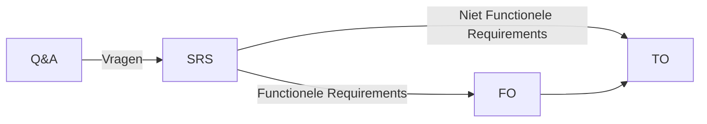
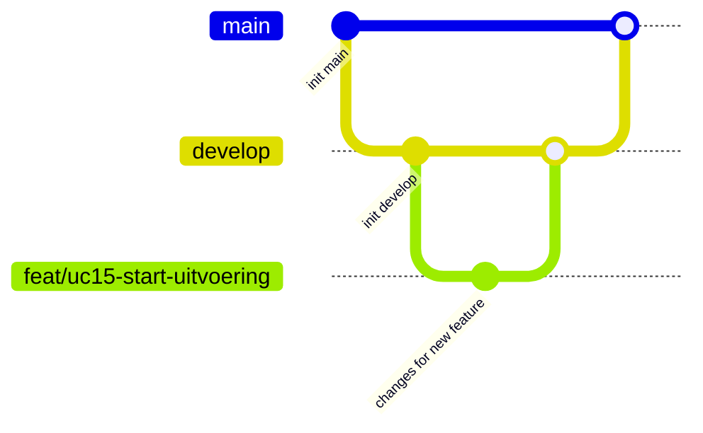

[Terug](/README.md)

# Way of Work (WoW) Document

Dit document betreft de globale vastlegging van onze werkwijze.

## Belangrijke wijziging in werkwijze!

Documentatie word verplaatst naar github hier dien je je werk te comitten naar een feature branch, het work item moet gekoppeld worden en een pull request moet aangemaakt worden, je mag niet je eigen pull request goedkeuren.

Voorheen werd er gebruik gemaakt van word documenten en StarUML voor het maken van UML diagrammen, samenwerken verliep via OneDrive, deze bestanden zijn nog steeds aanwezig, een gedeelte van deze inhoud is 1:1 overgezet naar github.

## Algemene afspraken

- Communicatie momenten.

  - Na afloop van de lessen.
  - Op zondag 10:00.
  - Bij stagneren direct vragen via WhatsApp of Teams.

- Planning staat vastgelegd in github projects.

  - Verdeeld in items waar je individueel aan kan werken.
  - Werk moet af op afgesproken deadline.
  - Review vereist.

- We prefereren een iterative werkwijze ten opzichte van een waterfall werkwijze, dat houd in dat wij geen eenmalige documentatie en modulering effort doen en vervolgens de documentatie links laten liggen. Wij stellen documentatie op die voldoende is om van start te gaan, bij nieuwe inzichten stellen wij ons ontwerp bij, voegen wij hier aan toe of schakelen wij de stakeholder bij om verdere details uit te vragen.

## Programmeer afspraken

- Clean Code principes aanhouden
- attributes/properties middels c# [auto properties](https://learn.microsoft.com/en-us/dotnet/csharp/programming-guide/classes-and-structs/auto-implemented-properties), geen get methods maken.
- https://learn.microsoft.com/en-us/dotnet/csharp/programming-guide/classes-and-structs/how-to-declare-and-use-read-write-properties
- wat betreft variabele benaming:
  - private variable: _privateVariable
  - public variable: PublicVariable

```csharp
private String _privateVariable { get; set; }
public String PublicVariable { get; private set; }
```

## Tooling

Bij de aanvang van het project is duidelijk dat wij onderstaande technieken gaan gebruiken voor documentatie en project management, verdere technische keuzes zullen later in het traject gemaakt worden wanneer de benodigde requirements in kaart gebruikt zijn.

- Github (Project management, CI/CD Pipeline & versie beheer.)
- Markdown documentatie
- Mermaid/PlantUML voor UML diagrams

## Documentatie werkwijze

Tijdens de analyse fase stellen wij in eerste instantie vragen aan de stakeholder op basis van de aangeleverde casus documenten. Deze vragen in combinatie met antwoord leggen wij vast in een vragen document, alle vragen in dit document zijn genummerd zodat wij hier eventueel later naar kunnen refereren. Antwoorden roepen waarschijnlijk meer vragen op, wij zullen daarom meerdere malen een meeting plannen met de stakeholder en vervolgens weer de feedback/verkregen antwoorden verwerken, dit doen wij iteratief, ieder vragen moment staat voor een iteratie.

Op basis van de verkregen antwoorden stellen wij een document met requirements op, op basis van de requirements zullen wij vervolgens een functioneel ontwerpen opstellen. Niet functionele requirements in combinatie met het functionele ontwerp zullen het technisch ontwerp vervolgens voeden.

Belangrijk is dat de oorsprong van verschillende design keuzes te herleiden is, in onderstaande diagram word inzichtelijk gemaakt hoe deze documenten zicht tot elkaar verhouden.



Dan onderstaande een overzicht van alle documentatie die wij plannen op te leveren met informatie die deze documenten in ieder geval zullen bevatten (toevoegingen zijn mogelijk.). Vanzelfsprekend dient alle vastlegging waar mogelijk ook onderbouwd te worden.

```filetree
.
├── Question & Answers (Q&A)
├── Software Requirement Specification (SRS)
├── Development onboarding
├── Functioneel ontwerp 
|   ├── Domein Model
|   └── Use Cases
|       └── Aangevuld met System Sequence Diagrams (SSD) waar nodig
└── Technisch Ontwerp
    ├── Frameworks & Libraries
    ├── Applicatie Architectuur
    ├── Class Diagram
    └── Use Case Designs
       ├── Toegepaste patterns
       └── Sequence Diagrams (SD)

```

## Documentatie standaarden

Hier en daar in het document zal aangegeven worden aan welke criteria een specifieke sectie moet voldoen, deze dienen als richtlijn/handvat en dienen verwijderd te worden voor de uiteindelijke oplevering.

---
:warning: **_CRITERIA:_**
Het document moet aan x voldoen zodat x.

---

Eventuele notities kan je aangeven middels:

---
:warning: **_NOTITIE:_**
Het document moet aan x voldoen zodat x.

---

## Git werkwijze



- **main**: Bevat altijd een werkende versie.
- **develop**: Is de versie waaraan momenteel gewerkt word, wanneer alle gewenste feature & bug branches gemerged zijn en deze volledig werkend is bevonden zetten we deze door naar de main branch middels een PR.
- **feature/bug branches**: De onderscheiding tussen feature en bug spreken voor zich, feature & bugs representeren een work item uit het KanBan bord (Github Projects). Merge de branch niet lokaal maar maak een pull request aan binnen GitHub naar de develop branch, iemand anders zal dan PR dan moeten goedkeuren.
